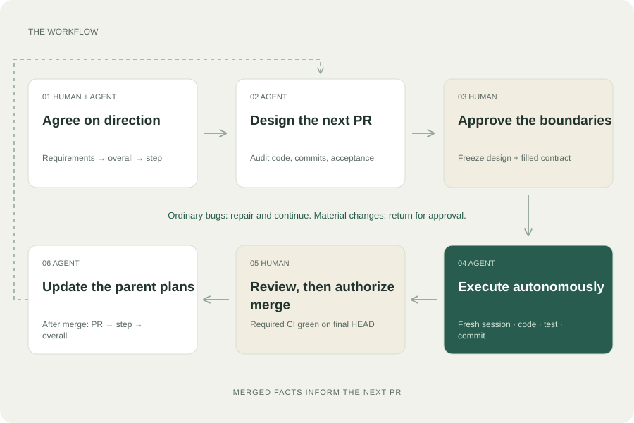
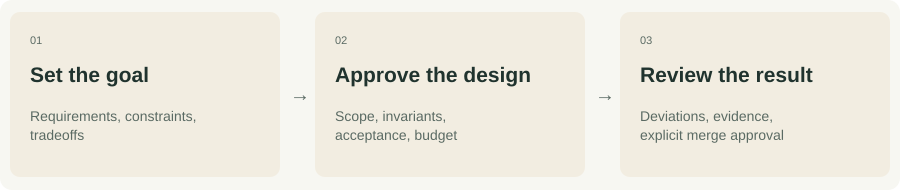
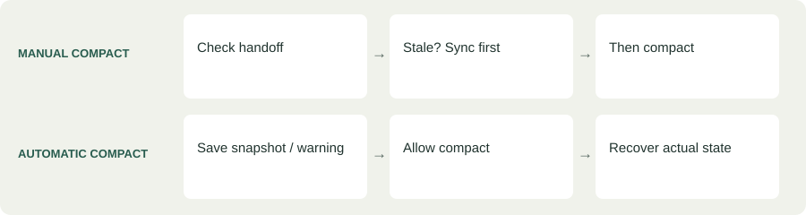

<!-- Generated file. Source: docs/content.en.json in the structured-coding repository, built by scripts/build_human_docs.py. Direct edits here are overwritten by the next build. -->

# Structured Coding

[Chinese mirror](README.zh-CN.md) · [Visual HTML guide](docs/index.html) · [Step-by-step tutorial](TUTORIAL.md)

Agree on the change. Let the agent build it. Bring the result back into the plan.

> **When this is worth it, and when it is not**
>
> This is built for sustained work on a large codebase. It earns its overhead when a change spans several PRs or sessions, when the code is big enough that an agent must audit before it edits, and when someone has to pick the work up later. For a typo, a one-file bug fix, or a throwaway prototype it is overkill: the planning documents will cost more than the change itself. Use your agent directly for those. Plans, tests, and LLM reviews can still be wrong; what this workflow adds is that their assumptions and evidence are written down where you can inspect them.

[Quick start](#start) · [What using it looks like](#example) · [Follow one PR, then plan the next.](#workflow) · [Going further](#further)

<a id="start"></a>

## Quick start

You need Git, Python 3.9 or later, and either Codex or Claude Code. Open a terminal on macOS, Linux, or WSL. The commands below download this toolkit and install it into an existing project; they do not create the application you want to build.

```sh
git clone --depth 1 https://github.com/yuema137/structured-coding.git
```

Keep the terminal in the parent directory that now contains the cloned structured-coding folder. Replace /path/to/your-project with the project you want the agent to work on, not the toolkit folder. Choose one of the following commands. Quote the path if it contains spaces. If you have already downloaded the toolkit, skip the clone command and use the existing copy.

Codex:

```sh
./structured-coding/scripts/install codex --project /path/to/your-project
```

Claude Code:

```sh
./structured-coding/scripts/install claude-code --project /path/to/your-project
```

Prefix your request with $structured-coding in Codex or /structured-coding in Claude Code. Describe the feature and its constraints; ask for planning first, not implementation.

For Codex, the installed folder is .agents/skills/structured-coding inside your project; for Claude Code, it is .claude/skills/structured-coding. Start a new agent session in that project and explicitly invoke the skill. The default installation includes the instructions and supporting resources but registers no hooks. If installation reports an existing copy, compare or back it up before updating; the installer will not overwrite your changes. Global settings and permissions stay unchanged.

[Want continuity or checkpoints? See the opt-in commands and limits below.](#hooks)

<a id="example"></a>

## What using it looks like

Three messages carry one feature from an idea to a reviewed PR. You approve twice; the agent does the work in between.

### 1. Plan the feature

```text
Use the structured-coding skill for this feature. Read its SKILL.md
entrypoint first and load the complete resources its table lists for the
current phase.
First agree with me on requirements, module-level direction, and overall
step boundaries; then detail the current step. Work on planning for now.
Requirements: ...
```

The agent asks what it cannot infer, inspects your actual code, and writes the overall plan with step boundaries. Nothing is implemented yet.

### 2. Prepare the next PR

```text
Read the overall and step documents, audit the current code, and prepare the
PR 01a design doc and filled execution contract. Use structured-coding:
start from its SKILL.md entrypoint and load what the PR design row lists.
Follow the original PR requirements for the commit checklist. Separate
implementation, validation, and review, and prepare the design for my
approval.
```

You get a PR design with an audited commit plan and a filled execution contract. Read it, ask for changes, and approve it once it describes what you actually want built.

### 3. Execute after approval, in a fresh session

```text
Execute PR 01a. The approved DESIGN FROZEN document is
.structured-coding/plans/order-flag/pr-01a.md, and the filled contract is
.structured-coding/plans/order-flag/pr-01a-contract.md.
Use structured-coding: read its SKILL.md entrypoint, then the complete
resources its execute row lists, including Implementation Working Rules and
TEST / CI / GATE in full. Reconcile actual state, and begin.
Continue autonomously to READY FOR OPERATOR REVIEW under the contract.
Do not merge.
```

A fresh session implements, validates, reviews its own logic, commits, and stops at a review handoff. You read the diff and decide whether to merge.

That is the whole loop. After a confirmed merge the agent updates the plans with what it learned, and the next PR starts from there.

## Why use Structured Coding?

A plan describes what you intend to build. It does not, on its own, tell an agent how to execute, what counts as evidence, when to ask you, or how to resume after losing context. This skill connects those decisions into one repeatable workflow.

- **Plan what is knowable**: You and the agent agree on the overall direction first. The agent inspects real code before detailing the next PR.
- **Keep the work recoverable**: The agent saves discoveries and evidence in the PR design so another session can resume without relying only on chat memory.
- **Give autonomy a boundary**: The agent fixes ordinary bugs and creates commits. You decide changes to the agreement and authorize merge.

<a id="workflow"></a>

## Follow one PR, then plan the next.



Follow 01 → 06. After a confirmed merge, use the findings to design the next PR.

The agent fixes ordinary bugs; you decide changes to the agreement.

## Where you step in.

You do not need to approve every commit. You do need to own the decisions that change the agreement.



After design approval, the agent investigates, implements, validates, reviews, records, and commits. If PR and CI work are authorized, it completes those too without waiting for you to prompt each step. The contract records which endpoints you authorized — commit, push, opening the PR, CI repair — and merge is never one of them. The agent may not quietly narrow that list either: a stopping point you did not ask for is a question for you, not a cautious default it can adopt on your behalf.

A material scope change or an action outside existing authorization comes back to you with evidence and a proposal.

<a id="further"></a>

## Going further

| Resource | What it covers |
| --- | --- |
| [Step-by-step tutorial](TUTORIAL.md) | The same loop on a real feature, one message at a time. |
| [Workflow reference](structured-coding/references/agent-workflow.md) | What the agent does in each phase, and where its authority stops. |
| [PR specification](structured-coding/prompts/pr-design-requirements.md) | What a PR design must contain before it can be approved. |
| [Optional hooks](structured-coding/references/platforms.md) | Installation, coverage, and the limits of what a hook can enforce. |
| [Behavior contract](structured-coding/references/hook-contract.md) | The complete target behavior, including the parts not yet shipped. |

<a id="standards"></a>

## Project standards (optional)

A project can state, once, what is true of its whole codebase, so you do not repeat it in every planning conversation. Copy the template to .structured-coding/standards.md and edit one block. This file is optional: without it the defaults below apply and nothing changes. Requirements specific to a single PR stay in that PR's conversation, so this file remains a stable repository asset.

| What you set | Where | Default |
| --- | --- | --- |
| Conventions an LLM judges | review.conventions | none; you write plain sentences |
| When those conventions are raised | review.trigger | at PR review readiness |
| Commands with a pass or fail result | checks.tools | ruff and pyright on changed files; pytest listed and off |
| When those checks apply | checks.trigger | at PR review readiness |
| Your own additions | .structured-coding/standards.local.md | may add and tighten only, never relax the team's |

Scope is set per tool because the right answer differs by tool: changed files suit ruff and pyright, and mislead for pytest, whose covering tests usually sit in files the change never touched. Tools are grouped by whether they execute your code, so pytest and mypy are recognized and still need a deliberate approval before anything runs them. Running the checks is an explicit command: each one comes back as PASS, FAIL, INCONCLUSIVE or NOT RUN, and a tool that is not installed is INCONCLUSIVE rather than a pass, because it examined nothing. Nothing runs automatically yet; there is no hook, so no commit and no merge is blocked.

## The details, when you need them.

Open the part relevant to your current question. Use the resource links above for the complete specifications.

<details id="kit">
<summary>Here is what the package provides.</summary>

<p>The package gives you a workflow to follow, specifications that define acceptable work, prompt templates that tell the agent how to execute, and optional hooks that help at specific moments. You do not have to assemble these pieces yourself. Installing them does not, however, turn every written rule into an enforced check.</p><div class="table-wrap"><table><thead><tr><th scope='col'>Resource</th><th scope='col'>What it provides</th></tr></thead><tbody><tr><td>Workflow</td><td>You and the agent plan the overall change, divide it into steps, and detail the next PR. After merge, the agent updates those plans with what it learned.</td></tr><tr><td>PR specification</td><td>The PR requirements tell the agent what a design must contain: inspected code, a commit plan, observable acceptance criteria, and separate evidence for implementation, validation, and review.</td></tr><tr><td>Execution templates</td><td>The working rules tell the agent how to proceed. A filled execution contract records what your project authorizes, what must stay unchanged, what budget applies, and when to stop.</td></tr><tr><td>Validation rules</td><td>The test rules help the agent choose checks that observe the promised behavior. A passing Unit test is not a substitute for a real model or lifecycle test when the claim depends on one.</td></tr><tr><td>Optional hook presets</td><td>The continuity preset helps preserve and recover work around compact. The checkpoints preset gives commit and review reminders. Neither supplies a merge guard.</td></tr><tr><td>Two platform packages</td><td>The project installer copies the same core skill for Codex or Claude Code. You can use either host; you do not need both, and installation does not change global settings.</td></tr></tbody></table></div>

</details>

<details id="roles">
<summary>What do you, the specification, the agent, and the hooks each do?</summary>

<p>Think of the specification as the written requirements, not a program watching every action. The agent reads those requirements and applies them to your project. A hook is a small program the host runs at a supported event, such as compact or a tool call. It can check or remind only where its implementation actually provides that behavior.</p><div class="table-wrap"><table><thead><tr><th scope='col'>Who or what</th><th scope='col'>What it is responsible for</th><th scope='col'>What it does not replace</th></tr></thead><tbody><tr><td>You</td><td>You define the intended behavior, approve the current PR design, decide material changes, and explicitly authorize merge after review.</td><td>You do not have to approve each ordinary fix, test, or commit that is already inside the agreed scope.</td></tr><tr><td>Specifications and prompt templates</td><td>They define what belongs in a PR design, how the agent executes, what counts as validation, and where authorization is required.</td><td>Written rules do not automatically block tools. The hook contract includes future requirements, not only features that are shipped.</td></tr><tr><td>The agent</td><td>It reads the full applicable rules, inspects code, drafts the plan, implements, tests, reviews logic, and keeps the design and handoff current.</td><td>A completed checklist or confident answer cannot replace test evidence or your approval. The agent remains responsible for following rules even without hooks.</td></tr><tr><td>Optional hooks</td><td>Continuity checks a recorded checkpoint before manual compact, attempts a rescue snapshot for automatic compact, and supplies recovery instructions. Checkpoints supplies commit-preparation advice and a review-intent notice.</td><td>They do not understand every design decision, prove tests passed, enforce design freeze, or prevent every merge. They do not run an automatic continuation loop.</td></tr></tbody></table></div><p>For example, the specification requires the PR design to record validation evidence. The agent runs the test and records its result. A checkpoints reminder can tell it to inspect missing evidence, but cannot decide that the test passed. You review the result before authorizing merge. Installing more hooks does not remove any of those responsibilities.</p>

</details>

<details id="sessions">
<summary>How many conversations do you need?</summary>

<p>A practical arrangement is one planning conversation and one fresh implementation conversation for each PR. The planning conversation can cover requirements, the overall plan, the current step, and the next PR design; these do not each need their own chat. The workflow requires a fresh implementation context for each new PR, not a separate chat for every commit or test. This separation matters because planning often contains rejected proposals and superseded assumptions. A fresh implementation session starts from the approved files and current code, reducing the chance that an old discussion is mistaken for the final requirement.</p><div class="table-wrap"><table><thead><tr><th scope='col'>Conversation</th><th scope='col'>What you do there</th><th scope='col'>When to switch</th></tr></thead><tbody><tr><td>Planning conversation</td><td>Discuss requirements, ask the agent to inspect the repo and write the plans, review the current PR design, and approve its execution contract.</td><td>When that PR is approved, ask for a kickoff with the actual document paths and open a fresh implementation conversation.</td></tr><tr><td>Implementation conversation for PR A</td><td>Give the approved design and contract to the agent. Let it implement, validate, review, commit, and handle authorized PR/CI work.</td><td>Keep ordinary fixes, commits, and compact/resume in the same PR context. Do not start PR B here.</td></tr><tr><td>Review of PR A</td><td>Read the diff and handoff. Request repairs in the same implementation conversation, or explicitly authorize merge after you are satisfied.</td><td>A separate reviewer conversation is optional, not required. Repairs need updated evidence and CI for the final HEAD.</td></tr><tr><td>Planning and implementation for PR B</td><td>After A is confirmed merged, have the agent update A, its parent step, and the overall plan. Use those records to detail and approve B.</td><td>You can return to the planning conversation or open a replacement that reads the saved plans. Start B in another fresh implementation conversation.</td></tr></tbody></table></div><p>For a feature with two PRs, that usually means three working conversations: planning, implementation A, and implementation B. This is an example, not a fixed quota. A long planning conversation may need replacement, and an interrupted implementation may need recovery. Saved project documents, rather than another chat&#x27;s memory, carry the agreement between sessions. A handoff is the agent&#x27;s saved continuation note: what is done, what is still running, and what to do next.</p>

</details>

<details id="records">
<summary>What documents does the agent maintain?</summary>

<div class="table-wrap"><table><tbody><tr><td>Overall</td><td>It records the overall goal, requirements, and main steps so each PR has a clear purpose.</td></tr><tr><td>Step</td><td>It explains which PRs complete this step, their dependencies, and how to observe their integration.</td></tr><tr><td>PR design</td><td>It records audited code and the commit plan, then keeps decisions, progress, and evidence current during implementation.</td></tr><tr><td>Execution contract</td><td>It records this PR&#x27;s approved scope, permitted actions, budget, and stopping conditions.</td></tr><tr><td>Handoff</td><td>It identifies the current PR, branch and HEAD, running jobs, logs, and the exact next action after recovery.</td></tr></tbody></table></div><p>DESIGN FROZEN protects the requirements you approved, not the entire document. The agent still records discoveries and progress. Implementation, validation, and review stay separate; each item is checked only when that work has actually been completed. If one step needs one PR, expand the step document instead of keeping two copies.</p>

</details>

<details id="compact">
<summary>What happens at compact or resume?</summary>

<p>Compact is the host&#x27;s process of shortening conversation history to free context; it does not create a new PR. A new PR starts in a fresh implementation session, while compact or resume continues the current PR. The optional continuity preset checks recorded mechanical freshness, attempts snapshots, and supplies recovery instructions. The agent still has to keep the design and handoff accurate and actually reconcile state after recovery.</p><p>On resume, reload the current design, filled contract, and full execution rules; check the repo and existing jobs before editing. A snapshot cannot invent decisions or test results. Automatic compact must not get stuck waiting for a perfect handoff.</p>

</details>

<details id="hooks">
<summary>Optional hooks: installation, coverage, and limits</summary>

<p class="status">OPTIONAL CONTINUITY + CHECKPOINTS + STANDARDS · NO MERGE GUARD</p><p>Choose continuity for compact recovery, checkpoints for commit/review reminders, standards to run your declared checks after a commit, or any combination. Both are off by default. Checkpoints advises; it does not enforce commits or certify readiness. Protocol tests do not establish native event delivery or model compliance. The agent does not dynamically register its own hooks.</p><h4>Choose your optional presets</h4><pre><code>./structured-coding/scripts/install codex --project /path/to/project --hooks checkpoints --dry-run
./structured-coding/scripts/install codex --project /path/to/project --hooks checkpoints
./structured-coding/scripts/install codex --project /path/to/project --hooks continuity checkpoints
./structured-coding/scripts/install codex --project /path/to/project --check-hooks
./structured-coding/scripts/install codex --project /path/to/project --upgrade-registration
./structured-coding/scripts/install codex --project /path/to/project --remove-hooks checkpoints
./structured-coding/scripts/install codex --project /path/to/project --remove-hooks</code></pre><p>Run these commands from the same parent directory used for the basic installation. Replace /path/to/project with the target project&#x27;s exact Git root; use claude-code instead of codex for Claude Code. Preview with --dry-run, then run the installation you chose; this list is a set of alternatives, not a sequence you must run in full. Installation adds selected presets, and removing one leaves the other usable. Bare --remove-hooks removes all hooks owned by this installer. Restart the host and inspect registration and trust in /hooks; the installer does not grant trust. Registered commands contain no path specific to your machine, so a registration committed to a shared settings file also works for your teammates, and each of them still reviews and trusts the hooks on their own machine. A registration made by an older release keeps its absolute paths and stays usable; --upgrade-registration rewrites it, which changes every command and so requires trusting the hooks again. The agent must still bind the current session, inspect staged changes before commit, and explicitly prepare its review handoff. Reminders cannot turn pending, inconclusive, or unrun checks into passes. Existing settings, skill files, and session data are preserved.</p><a href="https://github.com/yuema137/structured-coding/blob/main/structured-coding/references/continuity.md">Continuity preset interface →</a> · <a href="https://github.com/yuema137/structured-coding/blob/main/structured-coding/references/checkpoints.md">Checkpoints preset interface →</a><div class="table-wrap"><table><thead><tr><th scope='col'>Function</th><th scope='col'>Candidate event</th><th scope='col'>Intended behavior</th><th scope='col'>Shipped support</th></tr></thead><tbody><tr><td>H1 · Before implementation</td><td>PreToolUse</td><td>Check approved design, contract, repo state, and recovery. Deny dependent mutations when they do not match; still allow audit/design preparation.</td><td>Not implemented</td></tr><tr><td>H2 · Before commit</td><td>PreToolUse</td><td>Check or surface diff inspection, ledger, evidence, and deviations. Repair and retry autonomously; no per-commit human gate.</td><td>Checkpoints: explicit preparation and advice for direct git commit via Bash; no enforcement</td></tr><tr><td>H3 · Before merge</td><td>PreToolUse + merge-route coverage</td><td>Require trusted explicit approval for the exact PR, target branch, and candidate HEAD, plus readiness and CI/Gate evidence. Cover CLI, API, auto-merge, and direct target-branch bypasses.</td><td>Not implemented</td></tr><tr><td>H4 · Manual compact</td><td>PreCompact: manual</td><td>Block a stale handoff until synchronized, then allow compact.</td><td>Continuity: mechanical checkpoint freshness only</td></tr><tr><td>H5 · Automatic compact</td><td>PreCompact: auto</td><td>Allow compact; save a mechanical snapshot when needed. Preserve failures as warnings and require recovery.</td><td>Continuity: bounded snapshot attempt; never intentionally blocks automatic compact</td></tr><tr><td>H6 · Compact/resume</td><td>SessionStart + mutation guard</td><td>Resolve the current PR dynamically. Reload full rules and reconcile repo/process state before continuing; do not duplicate jobs.</td><td>Continuity: session-bound PR and full-read instructions; no mutation guard or proof of recovery</td></tr><tr><td>H7 · Review readiness</td><td>Stop / completion event</td><td>Verify real completion conditions, exact-final-HEAD CI, evidence, and handoff. Readiness does not authorize merge.</td><td>Checkpoints: explicit intent and at-most-once operator notice; no automatic continuation or evidence verdict</td></tr><tr><td>H7 · After merge</td><td>Observed result / remote-state check</td><td>Confirm merge, then request and verify PR → step → overall updates. The agent writes the lessons; the next PR uses a fresh session.</td><td>Not implemented</td></tr></tbody></table></div><p>An event name alone does not guarantee blocking. Adapters must handle each host&#x27;s protocol, trusted approval source, and tool-coverage gaps. A check after merge cannot prevent it. Read the contract&#x27;s acceptance scenarios before implementing an adapter.</p><p>Example: approval for PR 12 at HEAD A does not authorize merging a later HEAD B. The implementing agent cannot turn its own “approved” field into human authorization.</p><a href="https://github.com/yuema137/structured-coding/blob/main/structured-coding/references/hook-contract.md">Hook behavior contract →</a>

</details>

<details id="format">
<summary>A skill, a skillset, or a plugin?</summary>

<p>Today this is one standalone skill with supporting resources and optional hook presets. A skillset would contain several independently useful skills; a plugin can package those skills and other host integrations. Project installation stays simple. Updates are not managed, and hook registration is explicit and optional; plugin packaging remains an option for future distribution.</p>

</details>

---

[Detailed human guide](structured-coding/README.md) · [Step-by-step tutorial](TUTORIAL.md) · [Visual HTML guide](docs/index.html)

After cloning, open docs/index.html or docs/index.zh-CN.html in a browser. The HTML page contains the same complete tutorial and copyable messages, with the main steps visible rather than hidden in collapsed sections. GitHub's file viewer shows HTML source, not the rendered layout.

English is the authoritative source; Chinese is a synchronized mirror with English technical terms. The human explanation follows DongbeiGPT. Specifications and reusable prompts are in English.
