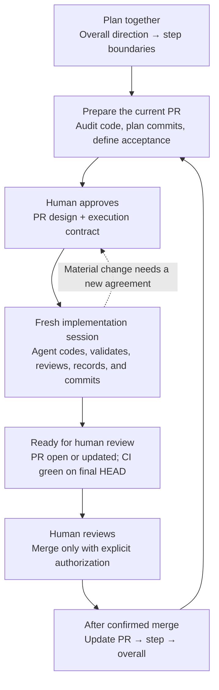

# Structured Coding

[Chinese mirror](README.zh-CN.md)

A reusable workflow for human-guided planning, autonomous agent coding, and review before merge.

## Quick start

### 1. Install for your agent

Run **one** of the following blocks in a terminal at the root of the project where you want to use the skill. These commands require Git and a POSIX shell, such as bash or zsh on macOS/Linux, or bash in WSL. Have Codex or Claude Code installed already; the commands below install this skill, not the agent itself.

Each block downloads the public repo's current `main` into a temporary directory and copies the complete platform package into your project. No GitHub SSH setup, zip download, or build step is needed. An existing skill directory, file, or symlink stops the command before copying, so it will not overwrite your installation.

#### Codex

```sh
(
  set -e
  skill_dir=".agents/skills/structured-coding"
  if [ -e "$skill_dir" ] || [ -L "$skill_dir" ]; then
    printf 'Already exists: %s. Compare your installation before updating.\n' "$skill_dir" >&2
    exit 1
  fi
  skill_tmp="$(mktemp -d)"
  git clone --depth 1 --branch main https://github.com/yuema137/structured-coding.git "$skill_tmp/source"
  mkdir -p ".agents/skills"
  cp -R "$skill_tmp/source/dist/codex/structured-coding" "$skill_dir"
)
```

Open this project in Codex and start your planning message with `$structured-coding`. The project-local location is `.agents/skills/structured-coding/`. If the skill does not appear, restart Codex. See the [official Codex skills documentation](https://learn.chatgpt.com/docs/build-skills).

#### Claude Code

```sh
(
  set -e
  skill_dir=".claude/skills/structured-coding"
  if [ -e "$skill_dir" ] || [ -L "$skill_dir" ]; then
    printf 'Already exists: %s. Compare your installation before updating.\n' "$skill_dir" >&2
    exit 1
  fi
  skill_tmp="$(mktemp -d)"
  git clone --depth 1 --branch main https://github.com/yuema137/structured-coding.git "$skill_tmp/source"
  mkdir -p ".claude/skills"
  cp -R "$skill_tmp/source/dist/claude-code/structured-coding" "$skill_dir"
)
```

Start Claude Code in this project and begin your planning message with `/structured-coding`. The project-local location is `.claude/skills/structured-coding/`. If you created the project's first skills directory during an existing session, restart Claude Code. See the [official Claude Code skills documentation](https://code.claude.com/docs/en/skills).

Both commands install only for the current project and leave your global configuration alone. To make the skill available across projects, see the personal installation paths in [platform notes](structured-coding/references/platforms.md). Do not copy only `SKILL.md`: the prompts and references must stay with it.

These commands install the skill only, not runtime hooks. See the [hook status and behavior table](#hooks) at the end.

### 2. Start with requirements, not an execution command

For a new feature, give the agent the desired behavior and constraints:

```text
Use the structured-coding workflow for this feature. First agree with me on
requirements, module-level direction, and overall step boundaries; then detail
the current step. Work on planning for now.
Requirements: ...
```

Discuss the proposed direction and PR boundaries. Then ask for the current PR's concrete design:

```text
Read the overall and step documents, audit the current code, and prepare the
PR 01a design doc and filled execution contract. Follow the original PR
requirements for the commit checklist. Separate implementation, validation,
and review, and prepare the design for my approval.
```

If you already have plans, provide their paths and the current phase instead of recreating them. A planning request is not permission to begin implementation.

### 3. Approve the design, then start a fresh execution session

Review the design and filled contract. Resolve scope, invariants, acceptance criteria, permissions, budget, and stop conditions. Once approved, use a new session for that PR's implementation:

```text
Execute PR 01a. The approved DESIGN FROZEN document is docs/plan/pr-01a.md,
and the filled contract is docs/plan/pr-01a-contract.md.
Use structured-coding. Read Implementation Working Rules and TEST / CI / GATE
in full, reconcile actual state, and begin.
Continue autonomously to READY FOR OPERATOR REVIEW under the contract.
Do not merge.
```

Replace the example paths with your actual documents. This short request points the agent to the full rules; it does not summarize away the execution template. Let the agent work through ordinary implementation and CI repairs. Participate when it presents a material decision or the final review handoff.

### 4. Review, confirm merge, and prepare the next PR

Review the diff and recorded evidence. Request repairs or explicitly authorize merge. After merge is confirmed, have the agent update the PR, step, and overall docs and prepare the next PR design from the merged code.

Do not carry straight on with the next PR in the previous implementation session. Approve its own design and contract, then start fresh. If you are merely resuming the current PR, give the agent its design, contract, and handoff paths instead.

## What is Structured Coding?

Structured Coding packages a personal agent-coding workflow into a reusable skill for Codex and Claude Code. You and the agent agree on what to build and the boundaries of the next PR. The agent then implements, tests, reviews, records its findings, and commits within that agreement. You review the result before merge. The merged code and lessons from that PR become the basis for planning the next one.

This repo provides the instructions, preserved prompt templates, and document requirements for that process. It does **not** contain a design for your particular project, and installing it does not start work automatically. You bring a feature or substantial change; the agent helps you prepare the project-specific plans and then execute them.

## The workflow at a glance



The normal implementation loop stays inside the agent's session: inspect, change code, check it, fix ordinary bugs, and continue. It does not stop for human approval before each commit. It does stop when a decision would change the approved goal, scope, or other binding conditions.

You can review the PR while CI runs. The review-ready handoff still requires the agreed work and validation to be complete, with required CI green on the exact final commit. Any merge needs explicit authorization.

## Why organize work this way?

A broad request leaves many decisions open. As an agent changes the code, it discovers callers the plan missed, tests assumptions, and sometimes finds that the proposed solution cannot preserve existing behavior. Without an explicit agreement and a current record, you have to reconstruct those decisions from a long chat and a large diff.

This workflow gives each decision a place:

- Plan distant work at the level you can justify now; inspect the current code before detailing the next PR.
- Agree on boundaries before execution so the agent can resolve local details without repeatedly asking you.
- Record discoveries and evidence during implementation so the final review does not depend on chat memory.
- Use merged results to revise the next plan so later PRs do not keep following assumptions that the code has disproved.

There is a cost: the agent must maintain useful documents, and you must review the design and final result. This is intended for substantial changes, especially work spanning several PRs or sessions. A typo fix or a small, isolated bug does not need the full ceremony. The documents make the reasoning inspectable; they do not guarantee that an LLM, test, or plan is correct.

## What happens at each stage?

### 1. Agree on the direction; detail only the work that is close

Start by telling the agent what behavior you want, what must remain unchanged, what is outside scope, and any cost limits. It can inspect the repo and propose an approach. You decide the requirements and the tradeoffs that would produce materially different results.

Planning has three levels. These are documents the agent prepares **in your project**, not three completed plans shipped by this repo.

| Level | Question it answers | What belongs there |
| --- | --- | --- |
| Overall doc | What are we building, and what are the major steps? | Requirements, module-level direction, major capabilities, risks, and step boundaries |
| Step doc | Which PRs complete this step, and how do they connect? | Files or file groups, relationships, PR boundaries, dependencies, and integration checkpoints |
| PR design doc | What exactly will the next PR change, and how will we know it worked? | Audited files and functions, a commit plan, acceptance criteria, validation, and review |

Do not specify every function in a distant PR. Its implementation may depend on code that has not been written yet. Keep its purpose and dependencies clear, then add detail when it becomes the next PR.

Each PR needs a meaningful integration checkpoint: an observable result showing the relevant parts working together. Also ask what plausible broken implementation the checks must catch. If a step needs just one PR, expand the step doc into its PR design instead of maintaining two copies of the same plan.

### 2. Audit the code, prepare the PR design, and approve execution

Before writing a file-and-function-level plan, the agent reads the real code, its callers, and its tests. That is the audit. A filename guessed from the feature description is not an audited implementation plan.

The PR design explains the goal, current state, scope, acceptance criteria, and planned commits. Each commit has concrete changes and separate checklists for implementation, validation, and LLM logic review. The complete [PR design requirements](structured-coding/prompts/pr-design-requirements.md) specify the format; this README does not replace them.

The agent also fills the project-specific execution contract from the [execution template](structured-coding/prompts/implementation-working-rules.md). It records the actual design path, implementation base, prerequisites, scope, conditions that must stay true, execution sequence, validation budget, permitted actions, stop conditions, and handoff requirements.

You review both before execution. In particular, check:

- Does the goal describe the result you want, without unrelated work?
- Do the acceptance criteria observe the behavior itself?
- Are existing behavior and other binding conditions protected?
- Is the agent authorized to perform the planned runs, push the branch, and open or update the PR?

Once approved, the design receives its `DESIGN FROZEN` header. The agreement is frozen: goal, scope, invariants, and acceptance criteria. The document is **not** locked against updates. It becomes a live ledger of progress, discoveries, decisions, and evidence.

### 3. Start a fresh session and let the agent execute inside the agreement

Every new PR starts in a fresh implementation session. The agent loads the approved PR design, filled contract, and complete execution and test rules. It reconciles them with the repo's actual state before editing. This keeps the new PR from inheriting abandoned approaches and temporary assumptions from the previous chat.

Within the approved boundaries, the agent can inspect code, investigate uncertainties, implement, test, review, fix ordinary bugs, update the ledger, and create meaningful commits. When authorized, it also pushes, opens or updates the PR, watches CI, and repairs failures. Commit inspection is a quality checkpoint, not a request for your permission at every commit.

| Situation | Agent's next action | Your part |
| --- | --- | --- |
| A function is in a different file than expected | Inspect it, correct the path in the plan, record the finding, and continue | Usually none |
| An extra caller must pass the new option | Trace the path, update it and its tests, and continue within scope | Usually none |
| A test or CI exposes an ordinary bug | Diagnose, repair, validate, and record the result | Usually none |
| The solution requires changing a frozen public interface or acceptance criterion | Explain the evidence, consequences, and proposed change | Decide whether to amend the agreement |
| A necessary real run exceeds the approved budget | Estimate the smallest useful run and its cost | Decide whether to authorize it |
| The PR meets the contract's completion conditions | Present the review-ready handoff | Review and explicitly authorize any merge |

The agent should investigate a local uncertainty before asking you to solve it. But discovering that a broader change is necessary does not authorize that change. Existing approval still counts; an example budget or permission printed in a template is not approval.

### 4. Keep evidence separate from “the code is written”

For each planned commit, the ledger tracks three different things:

- Implementation: what changed.
- Validation: what a test or real run actually observed.
- Review: what the LLM checked in the logic, contracts, callers, and possible omissions.

Each needs evidence. A passing test does not establish that the review happened, and a confident review does not establish that the program ran correctly. Record material failed assumptions and their corrections instead of rewriting the plan as if it had predicted everything.

Choose checks according to the claim you need to establish:

| Check | What it can establish |
| --- | --- |
| Static tools | Type, formatting, and call errors detectable without executing the behavior |
| Unit | Deterministic behavior, boundaries, and failure handling for explicit inputs |
| Gate 1 | Whether a real LLM follows the required prompt and protocol |
| Gate 2 | Whether real data, files, processes, training, or inference follow the required lifecycle |
| CI | Whether the exact final commit passes the repo's required automated checks |

Gate 1 and Gate 2 are labels used by this workflow, not new systems every project must add. Use a layer when an acceptance claim needs it. A feature with no LLM behavior does not need an LLM test merely because it uses this skill.

A mock cannot prove a real process completed the required lifecycle. A zero exit code cannot prove the intended path ran. Read the relevant logs and artifacts. Use focused checks during development and the canonical CI run for final evidence; do not repeatedly run expensive full suites without a new reason. All of this stays within the approved budget.

### 5. Review the completed PR, then decide whether to merge

The execution target is `READY FOR OPERATOR REVIEW`: agreed implementation, validation, and review are complete; the PR is open or updated; and required CI is green on its exact final HEAD.

The agent hands over the diff, evidence, discoveries, deviations, and remaining limitations. You compare the delivered behavior with the approved goal. If review calls for a repair, the agent makes it and revalidates. A new commit needs CI evidence for that new final HEAD; yesterday's green run does not cover today's change.

Merge remains a human decision. The skill does not treat passing tests, finishing a checklist, or opening a PR as authorization to merge.

### 6. Feed the result back into the plans before the next PR

After merge is confirmed, the agent marks the PR merged and updates the parent step, then the overall doc: `PR → step → overall`. It records both progress and what the implementation taught us about the remaining work.

Then it audits the merged code and details the immediate next PR. You approve that design and its contract, and execution starts in another fresh session. More distant PRs keep their direction and dependency notes until there is enough evidence to detail them.

This is why planning runs in both directions. Plans guide implementation; facts from implementation update the plans. If a discovery already invalidates the wider direction, raise it immediately rather than hiding it in a note for a later PR.

## A small example: one discovery changes the next PR

Suppose you want an alphabetical reading mode without changing the existing default. The step has two PRs: A connects the option to the reader; B makes resume work with the new mode.

1. Before A, the agent audits the path from CLI to reader. A's acceptance check supplies files `[c, a, b]`, enables the new mode, and observes visits `[a, b, c]`. A separate check protects the default behavior. Finding the new value in configuration alone would not prove that the reader uses it.
2. During A, the agent discovers a job builder between configuration and reader. It also has to pass the option. That is a bounded implementation correction: update the plan, code, and evidence, then continue without waiting for another commit approval.
3. The agent also discovers that resume currently records only a filename. In a list such as `[a, b, a]`, the name `a` cannot identify which occurrence to resume. It records this for B. If the finding also breaks A's approved acceptance criteria, A must address or escalate it now.
4. After A passes review and its merge is confirmed, the agent updates the step with the actual data path and the resume problem. It updates overall progress and risks too.
5. B's design now has a concrete question to resolve: how to identify an occurrence and its resume position. It is based on merged code and observed behavior, not a detailed guess written before A existed.

The point is not to write more documents. It is to preserve the discovery once, put it where the next decision will use it, and keep the current PR's boundaries clear.

## What if the session runs out of context?

A new PR and a resumed PR are different. Start a new PR fresh; after compaction, resume the same PR from its current checkpoint.

The PR design retains the agreement and evidence. A handoff file records the current PR, branch and HEAD, completed checkpoint, running jobs and log paths, unresolved issues, and the exact next action. On resume, the agent reloads the documents and checks the repo and processes before continuing.

For example, if a Gate was still running, check that job rather than starting another because the chat no longer mentions it. That avoids spending the same budget twice.

Before manual compact, synchronize the design and handoff. The hook contract also specifies recovery from automatic compact, including a mechanical snapshot when needed. Such a snapshot can record branch and changed-file state; it cannot invent decisions or test results. These hooks are specified, not implemented in this repo.

## What does this repo provide?

| Resource | What you use it for |
| --- | --- |
| [Skill entrypoint](structured-coding/SKILL.md) | Tell the agent which phase it is in and which complete resources to load |
| [Human guide](structured-coding/README.md) / [Chinese mirror](structured-coding/README.zh-CN.md) | A companion explanation of interaction, decisions, and recovery |
| [Agent workflow](structured-coding/references/agent-workflow.md) | Detailed operating instructions across planning, execution, and post-merge updates |
| [PR design requirements](structured-coding/prompts/pr-design-requirements.md) | Have the agent produce an audited PR design and commit checklist |
| [Implementation Working Rules](structured-coding/prompts/implementation-working-rules.md) | Fill the project-specific contract and execute using the complete preserved prompt |
| [TEST / CI / GATE rules](structured-coding/prompts/test-ci-gate-rules.md) | Assign validation to the right layer and control real-run costs |
| [Hook contract](structured-coding/references/hook-contract.md) | Specify what a future host integration must check before execution, during recovery, and before merge |
| [Platform notes](structured-coding/references/platforms.md) and [adaptation notes](structured-coding/references/adaptation.md) | Install on Codex or Claude Code and apply the prompts to a different project |

The core prompts were refined through prior use and are deliberately preserved. This README explains how to use them; its short examples are not replacements for the complete specifications.

In your target repo, the agent creates or updates the working documents. For example:

```text
docs/plan/
  overall.md          # Feature direction and steps
  step-01.md          # PR boundaries and dependencies
  pr-01a.md           # Approved design and live implementation ledger
  pr-01a-contract.md  # Filled execution contract
  pr-01a-handoff.md   # Current checkpoint and recovery details
```

These are illustrative paths, not a required directory layout. Follow the project's existing conventions and avoid duplicate authorities. If one step is one PR, its step doc can become the PR design directly.

Prefer a manual download? The [Codex zip](dist/structured-coding-codex.zip) and [Claude Code zip](dist/structured-coding-claude-code.zip) remain available. They contain the same files installed by the commands above.

## Languages, preserved specifications, and maintenance

English is the only authoritative source. Chinese `.zh-CN.md` files are synchronized mirrors of the explanations, retaining English technical terms such as LLM, agent, coding, bug, PR, commit, review, and hook. Update English first and its Chinese mirror in the same change.

The human READMEs follow [DongbeiGPT's explanation method](https://github.com/yuema137/DongbeiGPT/tree/3f722628c4d91711771ddd46cb1d9e69e9ba9541): concrete actors and actions, visible cause and effect, a worked example, and explicit boundaries and costs. Chinese also uses its restrained Dongbei conversational rhythm. English keeps the same structure and plain language without dialect. This changes the human explanation, not the agent instructions.

Specifications stay English-only: `SKILL.md`, PR requirements, execution prompts, test rules, and the hook contract. These maintained specifications define the current requirements. See the [language policy](structured-coding/references/language-policy.md) for synchronization rules.

Both packages are built from the maintained `structured-coding/` folder. Codex additionally receives UI metadata. To rebuild after a source change and check consistency, run from the repo root:

```sh
python3 scripts/build_packages.py
python3 scripts/build_packages.py --check
```

Edit the source, not generated copies in `dist/`. Synchronize changed translations and their recorded fingerprints before checking. The builder replaces known generated files, refuses unknown files or symlinks, and deletes nothing.

The checks verify protected specification hashes, mirror fingerprints, local links, the explicit list of publishable skill files, and agreement between the source, package directories, and zip files. Building and checking a fresh clone requires no private authoring material. Fingerprints identify document versions; they cannot establish translation quality. Passing these checks also does not prove that the workflow has completed a real PR.

<a id="hooks"></a>

## Technical appendix: hook status and intended behavior

### What is present, and what is missing?

**This package provides a hook specification, not executable hooks.** Installing either skill package does not register hooks, change host settings, or arrange for the agent to generate hooks when it starts working. In this edition, the agent follows the checks as instructions; there is no mechanical enforcement supplied by this repo.

A skill tells the agent what to do. A hook is code the host runs at a particular event, such as before a tool call or before compact. Where that event supports blocking, the hook can reject an operation after checking its prerequisites. Describing that check in Markdown does not install the code that performs it.

The full English [hook behavior contract](structured-coding/references/hook-contract.md) already defines H1–H7, the active-PR state, trusted authorization, failure behavior, and acceptance scenarios. [Platform notes](structured-coding/references/platforms.md) map those responsibilities to candidate host events. What remains unimplemented is the host adapter: code that receives those events, reads the actual state, and returns the host's supported decision format.

### Why are executable hooks not included yet?

The current release completed the reusable skill and behavior contract; the Codex and Claude Code adapters have not been implemented or integration-tested. This is an implementation gap, not a hidden installation step or a requirement for every user to have their agent improvise hooks.

An adapter needs more than an event name:

- Host-specific input and output handling. For example, current Codex documentation uses `continue: false` to stop `PreCompact`; Claude Code documents exit code `2` or `decision: "block"` and discards that event's `continue` field. The same event name does not make configuration interchangeable. See [Codex hooks](https://learn.chatgpt.com/docs/hooks#precompact) and [Claude Code hooks](https://code.claude.com/docs/en/hooks#precompact).
- A reliable way to identify the active repo, worktree, PR, design, and candidate HEAD. Merge approval must come from a trusted human/host channel, not an `approved: true` field the implementing agent can write.
- Tested coverage of the available edit and merge routes, including shell scripts, APIs, and auto-merge requests. Matching only `gh pr merge` is insufficient. OpenAI also documents tool paths that bypass a fresh hook check; hooks are not a complete sandbox. See [Codex tool coverage](https://learn.chatgpt.com/docs/hooks#tool-coverage).

These are the reasons an untested generic hook file would not establish the guarantees in the contract. Until an adapter is implemented and verified, use the procedural checks and human review without claiming automatic blocking or recovery.

### Which workflow functions should hooks support?

Every row below is **specified but not implemented in this package**. Event names are candidate integration points for Codex and Claude Code, not installed configuration or a promise of full coverage. The intended behavior comes from the existing contract; the table is a reader's summary, not a second specification.

| Function and contract | Candidate event / integration point | Intended hook behavior |
| --- | --- | --- |
| Design approval before implementation ([H1](structured-coding/references/hook-contract.md#h1-before-implementation-starts-or-mutates-project-behavior)) | `PreToolUse` on mutation routes | Check the approved freeze revision, filled contract, branch/base, prerequisites, and recovery status. Deny dependent implementation when they do not match; still allow audit and design preparation. |
| Commit checkpoint ([H2](structured-coding/references/hook-contract.md#h2-before-a-semantic-commit)) | `PreToolUse` on commit routes | Check or surface diff/staged-file inspection, ledger synchronization, evidence, and deviations. Let the agent repair and retry; do not add per-commit human approval. |
| Prevent unauthorized merge ([H3](structured-coding/references/hook-contract.md#h3-before-merge)) | `PreToolUse` plus coverage of every enabled merge route | Match trusted human authorization to the exact PR, target branch, and candidate HEAD; check readiness and required CI/Gate evidence. Deny missing or mismatched authorization, including attempts through auto-merge or direct target-branch operations. |
| Synchronize before manual compact ([H4](structured-coding/references/hook-contract.md#h4-before-manual-compact)) | `PreCompact`, `manual` | Check the design checkpoint, handoff, and actual worktree fingerprint. Block stale manual compact until synchronization is repaired, without another human approval step. |
| Preserve state before automatic compact ([H5](structured-coding/references/hook-contract.md#h5-before-automatic-compact)) | `PreCompact`, `auto` | Allow compact. If the semantic handoff is stale, save a mechanical snapshot and mark `RECOVERY REQUIRED`. If saving fails, preserve a warning and still allow compact; do not invent a summary or test results. |
| Recover the same PR after compact/resume ([H6](structured-coding/references/hook-contract.md#h6-on-compactresume-session-start)) | `SessionStart`, `compact` / `resume`, with a dependent-mutation guard | Resolve the current PR dynamically; supply its design, contract, checkpoint, and recovery warnings. Require full rules and actual-state reconciliation before implementation; reuse existing jobs rather than starting duplicates. |
| Verify the review-ready handoff ([H7](structured-coding/references/hook-contract.md#h7-at-readiness-and-after-merge)) | `Stop` or the host's applicable completion event | Check actual completion conditions, exact-final-HEAD CI, evidence, limitations, and handoff. Missing evidence remains a blocker, not a generic “done” marker. This does not authorize merge. |
| Update plans after confirmed merge ([H7](structured-coding/references/hook-contract.md#h7-at-readiness-and-after-merge)) | An observed merge result, such as a supported `PostToolUse` path, or explicit remote-state reconciliation | Confirm that merge happened, then request and check PR → step → overall updates. The agent writes the lessons; the hook does not invent them. The next PR needs a fresh implementation session. |

Manual and automatic compact intentionally differ: a manual compact can wait for the agent to update its handoff; blocking an unavoidable automatic compact can leave no context in which to recover. Likewise, observing a merge afterward cannot prevent it. H3 needs a check before the operation; H7 records what actually happened afterward.

For a concrete merge example, suppose you approve PR 12 at HEAD `A`. A review repair produces HEAD `B`. A future H3 adapter must not reuse an approval that covers only `A` to merge `B`; it must check authorization and evidence for the new candidate. In today's package, the agent is instructed to make that check, but no installed hook performs it.

### Should the user's agent configure hooks dynamically?

**Not as part of an ordinary coding task.** Loading the skill or approving a feature does not ask the agent to install hooks, modify global settings, or create its own source of merge authority. If you explicitly request hook integration, an agent can help implement a host adapter, show the configuration changes, and test the contract's acceptance scenarios before it is enabled.

What should be dynamic is the **runtime PR state**: the current worktree, PR, document paths, checkpoint, jobs, and candidate HEAD. H6 already requires resolving those from current state rather than hardcoding an old PR. That is different from generating new hook programs for every PR.

To assess a future adapter, use the contract's [acceptance scenarios](structured-coding/references/hook-contract.md#acceptance-scenarios-for-future-adapters), including stale handoffs, snapshot failures, changed HEADs, agent-written approval, alternative merge routes, and duplicate events. Document unsupported paths explicitly. The current instruction-only workflow remains usable without an adapter; it just does not provide those mechanical guarantees.
