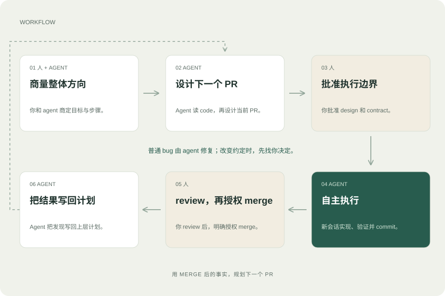
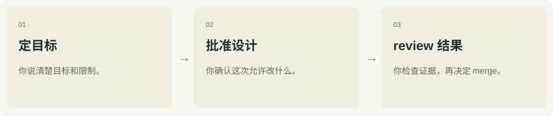
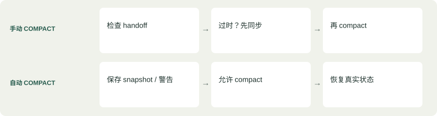

# Structured Coding

[English source](README.md) · [图文 HTML 阅读页](docs/index.zh-CN.html)

先商量好要改什么，让 agent 放手做，再把结果写回计划。

## 为啥要用 Structured Coding？

计划能写清想做什么，但光有计划，还没说清 agent 怎么执行、拿什么证据算完成、什么时候找你，以及 context 丢了以后怎么接着干。这个 skill 把这些决定连成一套能反复使用的 workflow。

- **眼前的工作，才写细**: 整体方向先定好；下一个 PR 的细节，先审查真实 code 再写。
- **做过的事，能接得上**: 发现和证据写进 PR design，不只留在聊天里。
- **放手执行，也有边界**: 普通 bug 和 commit 交给 agent；实质性决定和 merge 授权由你来。

## 一次一个 PR，把整个过程接成闭环。



顺着 01 → 06 看。确认 merge 后，用这次的发现设计下一个 PR。

普通 bug：修好继续。实质性改动：回来商量。

## 一整套 workflow 方案。

不只是找个地方写计划。这里有流程、具体 specification、执行用的 prompt templates、可选 hook preset，以及后续 guard 的行为约定。

| 资源 | 提供什么 |
| --- | --- |
| [Workflow](structured-coding/references/agent-workflow.zh-CN.md) | 从 overall、step 到 PR，自主执行，再把 merge 后的结果写回计划。 |
| [PR specification](structured-coding/prompts/pr-design-requirements.md) | 基于 audit 的 commit 计划、能观察到结果的验收条件，以及分开的实现、验证和 review 证据。 |
| [Execution templates](structured-coding/prompts/implementation-working-rules.md) | 执行用的 working rules，加上项目自己的 contract，定下范围、权限、预算和停止条件。 |
| [Validation rules](structured-coding/prompts/test-ci-gate-rules.md) | Static checks、Unit、真实 Gate 和最终 HEAD 的 CI。要证明什么，就检查实际发生了什么。 |
| [可选 hook preset](structured-coding/references/platforms.zh-CN.md) | Continuity 提供 compact 恢复；checkpoints 提供 commit 和 review 提醒。freeze 和 merge guard 仍是后续工作。 |
| [两套平台 package](structured-coding/references/platforms.zh-CN.md) | Codex 和 Claude Code 共用一个 skill，提供项目 installer，不改全局配置。 |

## 装好，再给一个需求。

需要 Git、Python 3.9 或更新版本，以及已安装的 Codex 或 Claude Code。命令适用于 macOS/Linux 和 WSL。

```sh
git clone --depth 1 https://github.com/yuema137/structured-coding.git
```

把 /path/to/your-project 换成已有项目的根目录。在刚才运行 clone 的目录里执行 installer。

Codex:

```sh
./structured-coding/scripts/install codex --project /path/to/your-project
```

Claude Code:

```sh
./structured-coding/scripts/install claude-code --project /path/to/your-project
```

Codex 的请求开头加 $structured-coding，Claude Code 加 /structured-coding。说清 feature 和约束，先让它规划，不要直接开始实现。

默认安装复制完整 skill，不注册 hook，也不覆盖已有副本。全局设置和权限不变。

[想加 continuity 或 checkpoints？下面有选装命令和限制说明。](#hooks)

## 你在哪些地方参与？

不用每次 commit 都点头。但会改变约定的决定，得由你来做。



批准设计到最终 review 之间：agent 自己调查、实现、验证、review、记录和 commit。获得授权的 PR/CI 工作也接着做。

遇到实质性范围变化，或者现有授权以外的操作，agent 带着证据和方案回来找你。

## 细节，用到时再展开。

按你现在的问题往下看。完整 specification 可以从上面的资源链接打开。

<details id="records">
<summary>agent 到底维护哪些文档？</summary>

<div class="table-wrap"><table><tbody><tr><td>Overall</td><td>方向、需求和 step 边界</td></tr><tr><td>Step</td><td>PR 边界、依赖和集成检查点</td></tr><tr><td>PR design</td><td>基于 audit 的 commit 计划，加上持续更新的决定、进度和证据</td></tr><tr><td>Execution contract</td><td>已批准的范围、权限、预算和停止条件</td></tr><tr><td>Handoff</td><td>当前 PR、branch/HEAD、任务、日志、检查点和下一步</td></tr></tbody></table></div><p>DESIGN FROZEN 冻结的是约定，不是过程记录。实现、验证和 review 分开记录。一个 step 如果就是一个 PR，直接扩展 step doc，别维护两份重复计划。</p>

</details>

<details id="compact">
<summary>compact 或 resume 时，怎么接着干？</summary>

<p>新 PR 用新 session；compact/resume 继续的是同一个 PR。可选 continuity preset 检查机械同步状态、尝试保存 snapshot，并给出恢复指令。语义同步和恢复仍由 agent 负责。</p><p>恢复时，重新读取当前 design、填好的 contract 和完整 execution rules；改 code 前核对 repo 和已有任务。snapshot 不能编决定或测试结果。自动 compact 不能因为 handoff 不完美就一直卡住。</p>

</details>

<details id="hooks">
<summary>可选 hook：安装、覆盖范围和限制</summary>

<p class="status">可选 CONTINUITY + CHECKPOINTS · 尚无 MERGE GUARD</p><p>需要 compact 恢复可选 continuity，需要 commit/review 提醒可选 checkpoints，也可同时安装。默认都不开。Checkpoints 提供建议，不拦截 commit，也不证明已达到交付条件。Protocol 测试不能证明 native 事件送达或模型遵守了提示。agent 不会动态注册自己的 hook。</p><h4>选择需要的 preset</h4><pre><code>./scripts/install codex --project /path/to/project --hooks checkpoints --dry-run
./scripts/install codex --project /path/to/project --hooks checkpoints
./scripts/install codex --project /path/to/project --hooks continuity checkpoints
./scripts/install codex --project /path/to/project --check-hooks
./scripts/install codex --project /path/to/project --remove-hooks checkpoints
./scripts/install codex --project /path/to/project --remove-hooks</code></pre><p>使用准确的项目 Git 根目录；Claude Code 用户把 codex 换成 claude-code。安装会追加 preset，选择移除一个时另一个仍可用。裸 --remove-hooks 移除全部自有 preset。重启 host 后检查 /hooks；安装不授予信任。agent 绑定 session，在 commit 前检查 staged 改动，并明确准备 review handoff。提醒不能把 pending、inconclusive 或未运行的检查变成 pass。已有设置、skill 文件和 session 数据会保留。</p><a href="https://github.com/yuema137/structured-coding/blob/main/structured-coding/references/continuity.md">Continuity preset interface →</a> · <a href="https://github.com/yuema137/structured-coding/blob/main/structured-coding/references/checkpoints.md">Checkpoints preset interface →</a><div class="table-wrap"><table><thead><tr><th scope='col'>功能</th><th scope='col'>候选事件</th><th scope='col'>应有的行为</th><th scope='col'>已提供的支持</th></tr></thead><tbody><tr><td>H1 · 实现前</td><td>PreToolUse</td><td>核对已批准设计、contract、repo 状态和恢复情况。不匹配就拒绝依赖这些条件的修改；audit 和设计准备仍然允许。</td><td>尚未实现</td></tr><tr><td>H2 · commit 前</td><td>PreToolUse</td><td>检查或提示 diff review、ledger、证据和偏离记录。agent 修好再试，不增加每个 commit 都找人批准的步骤。</td><td>Checkpoints：明确的准备步骤，以及 Bash 直接 git commit 的提示；不强制执行</td></tr><tr><td>H3 · merge 前</td><td>PreToolUse + merge 路径覆盖</td><td>要求来自可信通道、对应具体 PR、目标 branch 和候选 HEAD 的明确授权，并核对完成条件及 CI/Gate 证据。覆盖 CLI、API、auto-merge 和直接操作目标 branch 的绕行路径。</td><td>尚未实现</td></tr><tr><td>H4 · 手动 compact</td><td>PreCompact: manual</td><td>handoff 过时就先拦住，同步后再允许 compact。</td><td>Continuity：只检查机械 checkpoint 是否仍然对应当前状态</td></tr><tr><td>H5 · 自动 compact</td><td>PreCompact: auto</td><td>允许 compact；必要时保存机械 snapshot。保存失败也要留警告，并要求恢复。</td><td>Continuity：限时尝试 snapshot，不主动阻断自动 compact</td></tr><tr><td>H6 · compact/resume</td><td>SessionStart + 修改前检查</td><td>动态确认当前 PR，完整读取规则，核对 repo 和进程状态再继续，别重复启动任务。</td><td>Continuity：提供 session 绑定的 PR 和完整读取指令；没有修改 guard，也不能证明恢复完成</td></tr><tr><td>H7 · 准备交付 review</td><td>Stop / 完成事件</td><td>核对真实完成条件、最终 HEAD 的 CI、证据和 handoff。准备好 review 不等于允许 merge。</td><td>Checkpoints：明确 intent 后最多一次 operator 提醒；不自动续跑，也不判定证据通过</td></tr><tr><td>H7 · merge 后</td><td>已观察结果 / 核对远端状态</td><td>确认 merge，再要求并检查 PR → step → overall 更新。agent 写经验，下一个 PR 用新 session。</td><td>尚未实现</td></tr></tbody></table></div><p>有事件名，不等于一定能拦截。adapter 得处理各 host 的 protocol、可信授权来源和 tool 覆盖缺口。merge 后的检查不能倒过来阻止 merge。实现 adapter 前，先看 contract 的验收场景。</p><p>比如：批准 PR 12 的 HEAD A，不等于允许 merge 后来的 HEAD B。实现中的 agent 也不能自己写个“已批准”，就把它当成人的授权。</p><a href="https://github.com/yuema137/structured-coding/blob/main/structured-coding/references/hook-contract.md">Hook behavior contract →</a>

</details>

<details id="prompts">
<summary>具体该怎么跟 agent 说？</summary>

<p>这些是启动请求，不替代保留的完整 prompt。agent 仍然需要完整读取对应文件。</p><h4>规划 feature</h4><pre><code>Use the structured-coding workflow for this feature. First agree with me on
requirements, module-level direction, and overall step boundaries; then detail
the current step. Work on planning for now.
Requirements: ...</code></pre><h4>准备下一个 PR</h4><pre><code>Read the overall and step documents, audit the current code, and prepare the
PR 01a design doc and filled execution contract. Follow the original PR
requirements for the commit checklist. Separate implementation, validation,
and review, and prepare the design for my approval.</code></pre><h4>批准后，用新 session 执行</h4><pre><code>Execute PR 01a. The approved DESIGN FROZEN document is docs/plan/pr-01a.md,
and the filled contract is docs/plan/pr-01a-contract.md.
Use structured-coding. Read Implementation Working Rules and TEST / CI / GATE
in full, reconcile actual state, and begin.
Continue autonomously to READY FOR OPERATOR REVIEW under the contract.
Do not merge.</code></pre>

</details>

<details id="format">
<summary>这是 skill、skillset，还是 plugin？</summary>

<p>当前是一个独立 skill，带配套资源和可选 hook preset。多个能独立使用的 skill 可以组成 skillset；plugin 可以把它们和其他 host 接入一起打包。项目安装保持简单，不托管更新，hook 也需要明确选装；未来仍然可以提供 plugin 分发。</p>

</details>

<details id="fit">
<summary>什么工作值得走完整流程？</summary>

<p>适合跨 PR 或 session 的较大改动。改错别字、修一个独立小 bug，通常不用搬出整套流程。计划、测试和 LLM review 仍可能出错；这套 workflow 让假设和证据能被检查。</p>

</details>

---

[完整 human guide](structured-coding/README.zh-CN.md) · [图文 HTML 阅读页](docs/index.zh-CN.html)

clone 后，用浏览器打开 docs/index.html 或 docs/index.zh-CN.html。GitHub 文件页显示的是 HTML 源码，不是网页排版。

英文是唯一正确源；中文是同步镜像，保留英文专业术语。给人看的解释沿用 DongbeiGPT。specification 和可复用 prompt 全部使用英文。
