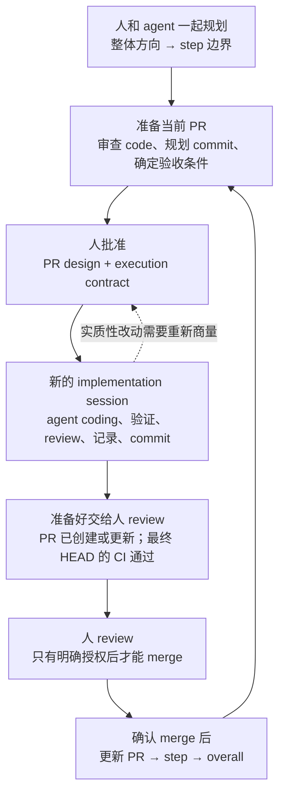

# Structured Coding

[English source](README.md)

一套可复用的 workflow：人参与规划，agent 自主 coding，merge 前由人 review。

## 先装上，再开始用

### 1. 给你用的 agent 安装 skill

需要 Git、Python 3.9 或更新版本，以及已经装好的 Codex 或 Claude Code。下面的命令适用于 macOS/Linux，也可以在 WSL 里运行。

先获取这个 repo，只做一次。已经有当前版本的 clone，就跳过这步：

```sh
git clone --depth 1 https://github.com/yuema137/structured-coding.git
```

然后选你用的 agent。把 `/path/to/your-project` 换成已有项目的根目录；路径里有空格就加引号。下面两条安装命令，在刚才执行 clone 的目录里运行。

#### Codex

```sh
./structured-coding/scripts/install codex --project /path/to/your-project
```

用 Codex 打开目标项目，在规划请求开头加上 `$structured-coding`。项目内的安装位置是 `.agents/skills/structured-coding/`。如果没看到这个 skill，重启 Codex 再看。依据见 [Codex 官方 skills 文档](https://learn.chatgpt.com/docs/build-skills)。

#### Claude Code

```sh
./structured-coding/scripts/install claude-code --project /path/to/your-project
```

在目标项目里启动 Claude Code，在规划请求开头加上 `/structured-coding`。项目内的安装位置是 `.claude/skills/structured-coding/`。如果你是在已有 session 运行时，才创建了项目的第一个 skills 目录，重启 Claude Code 再用。依据见 [Claude Code 官方 skills 文档](https://code.claude.com/docs/en/skills)。

已经在目标项目里了？那就写 installer 的完整路径，配上 `--project .`，比如：

```sh
/path/to/structured-coding/scripts/install codex --project .
```

installer 会复制完整的公开 skill 资源，clone 之后离线也能安装，遇到已有安装会拒绝覆盖。它不会创建指向 clone 的 symlink，所以以后移动 clone，不会把装好的 skill 弄坏。不过，这份副本也不会自动更新；替换已有安装前，先比较、备份。在 clone 里运行 `scripts/install --help` 可以查看用法。

安装只针对指定项目，不改全局设置、权限，也不安装可执行 hook。具体状态和功能表放在文末的 [hook 技术附录](#hooks)。个人级安装路径仍在 [platform notes](structured-coding/references/platforms.zh-CN.md) 里说明；这个 installer 特意要求你明确指定项目。

### 2. 先给需求，不要一上来就让它执行

新 feature 先说明期望行为和约束：

```text
Use the structured-coding workflow for this feature. First agree with me on
requirements, module-level direction, and overall step boundaries; then detail
the current step. Work on planning for now.
Requirements: ...
```

和 agent 讨论它提出的方向和 PR 边界，然后让它准备当前 PR 的具体设计：

```text
Read the overall and step documents, audit the current code, and prepare the
PR 01a design doc and filled execution contract. Follow the original PR
requirements for the commit checklist. Separate implementation, validation,
and review, and prepare the design for my approval.
```

如果已经有计划，就提供路径和当前阶段，不用从头再造一套。让 agent 做规划，不等于允许它开始实现。

### 3. 批准设计，再开新的 execution session

review 设计和填好的 contract，把范围、invariants、验收条件、权限、预算和停止条件定下来。批准后，开新 session 执行这个 PR：

```text
Execute PR 01a. The approved DESIGN FROZEN document is docs/plan/pr-01a.md,
and the filled contract is docs/plan/pr-01a-contract.md.
Use structured-coding. Read Implementation Working Rules and TEST / CI / GATE
in full, reconcile actual state, and begin.
Continue autonomously to READY FOR OPERATOR REVIEW under the contract.
Do not merge.
```

把示例路径换成你实际的文档路径。这段短请求是让 agent 找到完整规则，不是把 execution 模板压缩成这几句话。普通实现和 CI 修复，可以放手让它做；它提出实质性决定，或者交付最终 review handoff 时，你再参与。

### 4. review、确认 merge，再准备下一个 PR

review diff 和记录的证据。需要修就让 agent 修，可以接受就明确授权 merge。确认 merge 后，让 agent 更新 PR、step 和 overall docs，再根据 merge 后的 code 准备下一个 PR design。

别在上一个 implementation session 里顺手就开干下一个 PR。先批准新 PR 自己的设计和 contract，再开新 session。如果只是恢复当前 PR，提供它的 design、contract 和 handoff 路径就行。

## Structured Coding 是做什么的？

Structured Coding 把我自己整理的一套 agent coding workflow 做成了可复用的 skill，供 Codex 和 Claude Code 使用。你和 agent 先商量好要做啥，以及下一个 PR 的边界。agent 在这个约定里完成实现、测试、review、记录和 commit。merge 前，你来 review 结果。这个 PR merge 后的 code，加上实现中得到的新认识，再用来规划下一个 PR。

这个 repo 提供的是这套流程需要的指令、保留下来的 prompt 模板和文档要求。它**不包含你自己项目的设计方案**，装好以后也不会自动开工。你带着一个 feature 或较大的改动来，agent 帮你准备项目自己的计划，再按计划执行。

### 为啥当前先用独立 skill package？

这一版是一个 skill，配上 prompts 和 references，不是好几个要分别调用的 skill。多个这样的 skill 可以组成 skillset；plugin 则是由 host 管理的分发格式，可以把这些 skill 装进去。它们不是两条互相排斥的 workflow 设计路线。

当前项目选择独立 package 加显式 installer：两个 host 用同一套指令，装进去的文件在目标项目里看得见，也不用先配置 marketplace。代价是，这个 installer 不负责自动管理更新，也不注册 hook。

以后如果需要由 host 管理分发和更新，或者把更多组件一起发布，就值得考虑 plugin。OpenAI 推荐用 plugin 分发可复用 skill，Claude Code 也把 plugin 用于共享和带版本的发布。当前先保留独立形式，是为了把这版做得简单，不是说 plugin 不适合。依据见 [OpenAI 分发指引](https://learn.chatgpt.com/docs/build-skills#distribute-skills-with-plugins) 和 [Claude Code 的比较](https://code.claude.com/docs/en/plugins#when-to-use-plugins-vs-standalone-configuration)。

## 先看一遍完整流程



正常的实现过程，在 agent 的 session 里接着往下走：检查 code、修改、验证、修复普通 bug，再继续。它不需要每次 commit 前都停下来等你批准。只有遇到会改变已批准目标、范围或其他约束的决定，才需要停下来找你。

你可以在 CI 运行时开始 review PR。不过，要正式交付一个可供 review 的结果，约定的工作和验证仍然得完成，必需的 CI 也得在最终那个 commit 上通过。任何 merge 都需要明确授权。

## 为啥要这样安排？

一个很宽泛的需求，往往还留着不少决定没做。agent 一边改 code，一边会发现计划漏掉的调用方、验证原来的假设，有时还会发现：原来的方案保不住已有行为。如果事前没有明确约定，过程中也没留下记录，最后你就得翻很长的聊天记录和很大的 diff，自己拼出这些决定是怎么来的。

这套 workflow 给这些决定各自安排了去处：

- 远处的工作，先规划到现在有依据的程度；下一个 PR 要改哪些细节，先看过当前 code 再定。
- 执行前约定边界，agent 才能自己处理局部细节，不用反复问你。
- 实现时就记录发现和证据，最后 review 不用全靠聊天记忆。
- 用 merge 后的实际结果修正下一份计划，免得后面的 PR 还沿着已经被 code 推翻的假设走。

这也有成本：agent 得维护有用的文档，你得 review 设计和最终结果。它主要适合较大的改动，尤其是跨多个 PR 或 session 的工作。改个错别字，或者修一个小而独立的 bug，没必要把整套流程全搬出来。文档让你能检查推理过程，但不能保证 LLM、测试或计划一定正确。

## 每个阶段到底做什么？

### 1. 先商量方向，只把眼前的工作写细

一开始，你告诉 agent：想要什么行为、哪些已有行为不能变、哪些事不在这次范围内，以及成本限制。agent 可以检查 repo，提出方案。需求怎么定、不同取舍会带来什么结果，这些由你来决定。

规划分三层。下面这些文档，是 agent **在你的项目里准备的**，不是这个 repo 随包附送的三份现成计划。

| 层级 | 回答什么问题 | 写到什么程度 |
| --- | --- | --- |
| Overall doc | 我们要做什么，分哪几个大 step？ | 需求、module 层面的方向、主要能力、风险和 step 边界 |
| Step doc | 哪几个 PR 完成这个 step，它们怎么衔接？ | 文件或文件组、相互关系、PR 边界、依赖和集成检查点 |
| PR design doc | 下一个 PR 具体改什么，怎么知道它改对了？ | 审查过的文件和 function、commit 计划、验收条件、验证和 review |

别急着把很后面的 PR 写细到每个 function。它可能依赖还没写出来的 code。先把用途和依赖讲明白，等轮到它成为下一个 PR，再补细节。

每个 PR 都得有一个有意义的集成检查点：你能观察到一个结果，说明相关部分确实配合起来了。还要反过来问一句：如果实现以一种看着挺合理的方式写错了，这些检查能不能抓住？一个 step 如果只需要一个 PR，就把 step doc 直接扩展成 PR design，别维护两份讲同一件事的计划。

### 2. 先审查 code，再准备 PR design，最后批准执行

写到文件和 function 层面的计划之前，agent 要读真实 code、调用方和测试。这就是 audit。从 feature 描述猜出一个文件名，不算做过 audit 的实现计划。

PR design 要写清目标、当前状态、范围、验收条件和 commit 计划。每个 commit 都有具体改动，并分别记录 implementation、validation 和 LLM logic review 的 checklist。完整格式由 [PR design requirements](structured-coding/prompts/pr-design-requirements.md) 规定，这份 README 不替代它。

agent 还要根据 [execution 模板](structured-coding/prompts/implementation-working-rules.md)，填好当前项目的 execution contract。它记录真实的设计文档路径、实现基线、前置条件、范围、必须保持的条件、执行顺序、验证预算、允许的操作、停止条件和 handoff 要求。

执行前，你要 review 这两份内容。重点看这几件事：

- 目标是不是你要的结果，有没有夹带无关工作？
- 验收条件观察的是实际行为吗？
- 已有行为和其他不能打破的条件，有没有保护好？
- 计划里的运行、push branch、创建或更新 PR，agent 是否已经获得授权？

批准后，设计文档加上 `DESIGN FROZEN` 标记。冻结的是约定：目标、范围、invariants 和验收条件。**不是说这份文档从此不能改了。** 它接下来要持续记录进度、发现、决定和证据，也就是这次实现的 live ledger。

### 3. 开一个新 session，让 agent 在约定里自主执行

每个新 PR 都从新的 implementation session 开始。agent 读取已批准的 PR design、填好的 contract，以及完整的 execution 和 test rules。动 code 前，先核对这些内容和 repo 的实际状态。这么做，是为了不把上一个聊天里已经放弃的方案和临时假设带进新 PR。

在批准的边界内，agent 可以检查 code、调查不确定的地方、实现、测试、review、修复普通 bug、更新 ledger，并创建有明确含义的 commit。获得授权后，它还可以 push、创建或更新 PR、跟进 CI、修复失败。commit 前的检查是质量检查点，不是每次都要找你要许可。

| 遇到的情况 | agent 接下来做什么 | 你需要做什么 |
| --- | --- | --- |
| function 实际在另一个文件里 | 检查实际位置，修正计划路径，记录发现，继续 | 通常不用参与 |
| 还有一个调用方得传递新选项 | 追清调用路径，补 code 和测试，在范围内继续 | 通常不用参与 |
| 测试或 CI 暴露了普通 bug | 定位、修复、验证，记录结果 | 通常不用参与 |
| 方案需要改变已冻结的 public interface 或验收条件 | 说明证据、影响和建议改法 | 决定是否修改约定 |
| 必要的真实运行超出已批准预算 | 估算最小有用运行及其成本 | 决定是否授权 |
| PR 满足 contract 的完成条件 | 提交可供 review 的完整 handoff | review，并明确授权任何 merge |

局部不确定的地方，agent 应该先调查，别一上来就让你替它找答案。但查出来“得改得更大”，不等于它就有权直接扩大范围。已有授权继续有效；模板里印着的示例预算或权限，不算你的批准。

### 4. 分清“code 写完了”和“已经有证据了”

每个计划中的 commit，ledger 都分别跟踪三件事：

- Implementation：改了什么。
- Validation：测试或真实运行实际观察到了什么。
- Review：LLM 检查了哪些逻辑、约定、调用方和可能遗漏的地方。

每一项都要有证据。测试通过，不代表 review 已经做了；review 说得很有信心，也不代表程序真的跑对了。重要的错误假设和修正过程要留下来，别把计划改得像是一开始就全猜对了。

你想证明什么，就选能观察到那件事的检查：

| 检查方式 | 能确认什么 |
| --- | --- |
| Static tools | 不运行目标行为就能发现的类型、格式和调用错误 |
| Unit | 给定明确输入时的确定性行为、边界和失败处理 |
| Gate 1 | 真实 LLM 是否遵循要求的 prompt 和 protocol |
| Gate 2 | 真实数据、文件、进程、training 或 inference 是否走过要求的 lifecycle |
| CI | 最终那个 commit 是否通过 repo 要求的自动检查 |

Gate 1 和 Gate 2 是这套 workflow 用的名称，不是每个项目都得新建的系统。验收要求需要哪一层，就用哪一层。一个不涉及 LLM 行为的 feature，不用因为装了这个 skill 就硬加 LLM 测试。

mock 不能证明真实进程走完了要求的 lifecycle。exit code 为零，也不能证明目标路径真的执行了。要看相关日志和产物。开发过程中跑有针对性的检查，最终证据使用 canonical CI；没有新理由，别反复跑昂贵的全套测试。这些运行都得在已批准预算内。

### 5. review 完成的 PR，再决定是否 merge

执行要到达的状态是 `READY FOR OPERATOR REVIEW`：约定的 implementation、validation 和 review 都完成了；PR 已创建或更新；必需的 CI 在它最终那个 HEAD 上通过了。

agent 交付 diff、证据、新发现、偏离计划的地方和剩余限制。你对照已批准的目标，看实际行为是否符合要求。如果 review 要求修复，agent 继续改，再验证。新 commit 需要新 final HEAD 对应的 CI 证据；昨天的 CI 通过，不能替今天的改动作证。

merge 仍然由人决定。测试通过、checklist 勾完、PR 已创建，都不等于获得了 merge 授权。

### 6. 把实际结果写回计划，再准备下一个 PR

确认 merge 后，agent 标记当前 PR 已 merge，再更新所属 step，最后更新 overall doc：`PR → step → overall`。不光记“做完了什么”，也要记“这次实现让我们对剩下的工作多知道了什么”。

然后，agent 审查 merge 后的 code，把紧接着的下一个 PR 写细。你批准它的设计和 contract，再用一个新的 session 开始执行。更远的 PR 先保留方向和依赖说明，等证据够了再展开。

所以，规划不是单向往下发任务。计划指导实现，实现中查清的事实再反过来更新计划。如果一个发现已经推翻了整体方向，要马上提出，不能塞进“以后再看”的备注里。

## 用一个小例子串起来：这次的发现，怎么改变下一个 PR

假设你想增加按字母顺序读取的模式，同时保持原来的默认行为不变。这个 step 分两个 PR：A 把选项一路接到 reader；B 让 resume 适配新模式。

1. A 开始前，agent 审查从 CLI 到 reader 的路径。A 的验收检查给出文件 `[c, a, b]`，开启新模式，再观察实际访问顺序是不是 `[a, b, c]`。另一个检查保护默认行为。只在 configuration 里找到新选项，不足以证明 reader 真用了它。
2. 做 A 时，agent 发现 configuration 和 reader 中间还有一个 job builder，它也得传递这个选项。这属于边界内的实现修正：更新计划、code 和证据，然后接着干，不用等你再批一次 commit。
3. agent 还发现，当前 resume 只记录文件名。遇到 `[a, b, a]` 这样的列表，光有名字 `a`，说不清要从哪一次出现的位置恢复。它把这件事记录给 B。如果这个发现同时破坏了 A 已批准的验收条件，那 A 现在就得处理，或者提请你决定。
4. A 通过 review，并确认 merge 后，agent 把真实数据路径和 resume 问题写回 step，也更新 overall 的进度和风险。
5. B 的设计这时就有一个具体问题要解决：怎么区分同名文件的不同出现位置，以及从哪儿恢复。它依据的是 merge 后的 code 和观察结果，不是 A 还没写时就详细猜出来的方案。

重点不是多写几份文档。而是把发现记下来，放到下一次做决定能用上的地方，同时守住当前 PR 的边界。

## session 的 context 不够了，怎么办？

新 PR 和恢复当前 PR，是两回事。新 PR 用新 session；compaction 后，还是从当前检查点继续同一个 PR。

PR design 保存约定和证据。handoff 文件记录当前 PR、branch 和 HEAD、已完成的检查点、正在运行的任务和日志路径、未解决的问题，以及下一步具体做什么。恢复时，agent 重新读取文档，检查 repo 和进程，再继续工作。

比如，一个 Gate 还在跑，就先检查那个任务。不能因为压缩后的聊天里没提到它，就再启动一遍。否则同一笔预算可能花两次。

手动 compact 前，要把 design 和 handoff 同步到实际状态。hook contract 也规定了自动 compact 后怎么恢复，包括必要时保存一份机械 snapshot。这种 snapshot 可以记录 branch 和改动文件状态，但不能凭空补出决定或测试结果。这些 hook 目前只有 specification，repo 里还没有实现。

## 这个 repo 具体提供了什么？

| 资源 | 拿它做什么 |
| --- | --- |
| [Skill 入口](structured-coding/SKILL.md) | 告诉 agent 当前处于哪个阶段，以及要完整读取哪些资源 |
| [Human guide](structured-coding/README.md) / [中文镜像](structured-coding/README.zh-CN.md) | 配套阅读，进一步理解人怎么参与、怎么做决定、怎么恢复工作 |
| [Agent workflow](structured-coding/references/agent-workflow.zh-CN.md) | 给 agent 的详细操作指引，覆盖规划、执行和 merge 后更新 |
| [PR design requirements](structured-coding/prompts/pr-design-requirements.md) | 让 agent 产出基于 audit 的 PR design 和 commit checklist |
| [Implementation Working Rules](structured-coding/prompts/implementation-working-rules.md) | 填写项目自己的 contract，并使用完整保留的 prompt 执行 |
| [TEST / CI / GATE rules](structured-coding/prompts/test-ci-gate-rules.md) | 为验收要求选择对应的验证层，并控制真实运行的成本 |
| [Hook contract](structured-coding/references/hook-contract.md) | 规定未来接入 host 时，执行前、恢复时、merge 前必须检查什么 |
| [Platform notes](structured-coding/references/platforms.zh-CN.md) 和 [adaptation notes](structured-coding/references/adaptation.zh-CN.md) | 安装到 Codex 或 Claude Code，并把 prompt 用到不同项目 |

核心 prompt 是之前实际使用、反复迭代出来的，所以特意保留。README 负责讲怎么用，里面的简短示例不能替代完整 specification。

在你的目标 repo 里，agent 会创建或更新实际工作的文档。比如：

```text
docs/plan/
  overall.md          # Feature 的方向和 step 划分
  step-01.md          # PR 边界和依赖
  pr-01a.md           # 已批准的设计，以及持续更新的实现记录
  pr-01a-contract.md  # 填好的 execution contract
  pr-01a-handoff.md   # 当前检查点和恢复信息
```

这些路径只是示例，不是强制目录结构。沿用项目已有约定，别给同一件事留两份互相竞争的依据。一个 step 如果就是一个 PR，它的 step doc 可以直接扩展成 PR design。

想手动下载也行：[Codex zip](dist/structured-coding-codex.zip) 和 [Claude Code zip](dist/structured-coding-claude-code.zip) 仍然提供，里面的文件和上面命令安装的一样。

## 语言、保留的 specification，以及维护方式

英文是唯一正确源。中文 `.zh-CN.md` 是解释文档的同步镜像，保留 LLM、agent、coding、bug、PR、commit、review、hook 等 English 专业术语。先改英文，再在同一次改动里同步中文。

给人看的 README 使用 [DongbeiGPT 的解释方式](https://github.com/yuema137/DongbeiGPT/tree/3f722628c4d91711771ddd46cb1d9e69e9ba9541)：说清谁在做什么、前因后果怎么连起来，用一个具体例子走通，并把边界和成本讲出来。中文也沿用它克制的东北口语节奏；英文保持相同结构和清楚的表达，不加方言。改的是给人看的解释，不是 agent 指令。

Specification 保持全英文，包括 `SKILL.md`、PR requirements、execution prompts、test rules 和 hook contract。当前要求以这些维护中的 specification 为准。同步规则见 [language policy](structured-coding/references/language-policy.md)。

两个 package 都从维护中的 `structured-coding/` 文件夹构建，Codex 额外包含 UI metadata。源文件改完以后，在 repo 根目录运行下面的命令，重新构建并检查一致性：

```sh
python3 scripts/test_install.py
python3 scripts/build_packages.py
python3 scripts/build_packages.py --check
```

改源文件，不要直接改 `dist/` 里的生成副本。检查前，同步改过的翻译和对应的 fingerprint 记录。builder 会替换已知的生成文件，遇到未知文件或 symlink 会拒绝操作，不会删除文件。

检查会核对受保护 specification 的 hash、镜像 fingerprint、本地链接、明确列出的可发布 skill 文件，以及源文件、package 目录和 zip 是否一致。刚 clone 下来的 repo，不需要任何私有开发材料就能构建和检查。fingerprint 只能识别文档版本，判断不了翻译是否准确。检查通过，也不等于这套 workflow 已经完成过一个真实 PR。

<a id="hooks"></a>

## 技术附录：hook 现在有什么，应该负责什么？

### 已经提供了什么，还缺什么？

**这个 package 提供的是 hook specification，没有可执行 hook。** 安装任意一套 skill package，都不会注册 hook、修改 host 设置，也不会安排 agent 开工后自动生成 hook。当前版本靠 agent 按指令执行检查；这个 repo 没有提供程序层面的强制检查。

skill 告诉 agent 应该做什么。hook 则是一段由 host 在特定时机运行的 code，比如 tool call 前，或者 compact 前。如果这个事件支持拦截，hook 就可以检查前置条件，并拒绝不符合条件的操作。在 Markdown 里写明这项检查，不等于执行检查的 code 已经装好了。

完整的英文 [hook behavior contract](structured-coding/references/hook-contract.md) 已经定义了 H1–H7、当前 PR 的状态、可信授权、失败处理和验收场景。[Platform notes](structured-coding/references/platforms.zh-CN.md) 也列出了这些职责可能对应的 host 事件。还没实现的是 host adapter：接收这些事件、读取真实状态，再按 host 支持的格式返回决定的那层 code。

### 为啥现在没附上可执行 hook？

当前版本完成了可复用的 skill 和行为约定，Codex、Claude Code 的 adapter 还没有实现，也没有做过集成测试。这是尚未完成的实现工作，不是藏在后面的安装步骤，也不是要求每个用户都让自己的 agent 临时拼一套 hook。

adapter 需要的，不只是一个事件名：

- 按 host 处理输入和输出。比如，当前 Codex 文档用 `continue: false` 阻止 `PreCompact`；Claude Code 文档规定用 exit code `2` 或 `decision: "block"`，并且会忽略这个事件的 `continue` 字段。事件名一样，不代表配置能直接互换。依据见 [Codex hooks](https://learn.chatgpt.com/docs/hooks#precompact) 和 [Claude Code hooks](https://code.claude.com/docs/en/hooks#precompact)。
- 可靠地确认当前 repo、worktree、PR、design 和候选 HEAD。merge 授权必须来自可信的人或 host 通道，不能拿实现中的 agent 自己写的 `approved: true` 当批准。
- 测试实际可用的修改和 merge 路径，包括 shell script、API 和 auto-merge 请求。只匹配 `gh pr merge` 不够。OpenAI 也列出了不会重新触发 hook 检查的 tool 路径；hook 不是完整的 sandbox。依据见 [Codex tool coverage](https://learn.chatgpt.com/docs/hooks#tool-coverage)。

所以，放一个没验证过的通用 hook 文件进去，并不能证明 contract 里的保证已经成立。adapter 实现并验证之前，可以按流程检查、由人 review，但不能声称已经会自动拦截或自动恢复。

### 哪些 workflow 功能应该由 hook 支持？

下表每一项都是**已有 specification，但本 package 尚未实现**。事件名是 Codex、Claude Code 可能接入的位置，不是已经安装的配置，也不保证覆盖所有路径。预期行为来自现有 contract；这张表方便人阅读，不另立一份 specification。

| 功能及 contract | 候选事件 / 接入位置 | hook 应有的行为 |
| --- | --- | --- |
| 实现前检查设计批准（[H1](structured-coding/references/hook-contract.md#h1-before-implementation-starts-or-mutates-project-behavior)） | 修改路径上的 `PreToolUse` | 检查已批准的 freeze 版本、填好的 contract、branch/base、前置条件和恢复状态。不匹配就拒绝依赖这些条件的实现操作；audit 和设计准备仍然允许。 |
| commit 检查点（[H2](structured-coding/references/hook-contract.md#h2-before-a-semantic-commit)） | commit 路径上的 `PreToolUse` | 检查或提示 diff/staged-file review、ledger 同步、证据和偏离计划的记录。让 agent 修好再试，不增加每次 commit 都找人批准的步骤。 |
| 阻止未经授权的 merge（[H3](structured-coding/references/hook-contract.md#h3-before-merge)） | `PreToolUse`，并覆盖所有已启用的 merge 路径 | 将可信的人类授权与具体 PR、目标 branch 和候选 HEAD 对上，再检查完成条件和必需的 CI/Gate 证据。授权缺失或不匹配就拒绝，也要覆盖 auto-merge 和直接操作目标 branch 的绕行路径。 |
| 手动 compact 前同步（[H4](structured-coding/references/hook-contract.md#h4-before-manual-compact)） | `PreCompact`，`manual` | 核对 design 检查点、handoff 和真实 worktree fingerprint。状态过时就先拦住手动 compact，等同步好再继续，不用再找人批准。 |
| 自动 compact 前保留状态（[H5](structured-coding/references/hook-contract.md#h5-before-automatic-compact)） | `PreCompact`，`auto` | 允许 compact。如果语义 handoff 过时，保存机械 snapshot，并标记 `RECOVERY REQUIRED`。保存失败也要留警告并放行，不能凭空编摘要或测试结果。 |
| compact/resume 后恢复同一个 PR（[H6](structured-coding/references/hook-contract.md#h6-on-compactresume-session-start)） | `SessionStart`，`compact` / `resume`，配合后续修改前的检查 | 动态确认当前 PR，提供它的 design、contract、检查点和恢复警告。实现前要求完整读取规则、核对实际状态；已有任务接着用，别重复启动。 |
| 核对可供 review 的 handoff（[H7](structured-coding/references/hook-contract.md#h7-at-readiness-and-after-merge)） | `Stop` 或 host 对应的完成事件 | 核对实际完成条件、最终 HEAD 的 CI、证据、限制和 handoff。缺证据就是尚未完成，不能拿一句“done”代替。通过这项检查也不等于允许 merge。 |
| 确认 merge 后更新计划（[H7](structured-coding/references/hook-contract.md#h7-at-readiness-and-after-merge)） | 已观察到的 merge 结果，比如受支持的 `PostToolUse` 路径，或者主动核对远端状态 | 确认 merge 确实发生，再要求并检查 PR → step → overall 更新。经验和结论由 agent 写，hook 不替它编。下一个 PR 要用新的 implementation session。 |

手动和自动 compact 是特意分开的：手动 compact 可以等 agent 先把 handoff 更新好；不可避免的自动 compact 要是被拦住，可能连恢复所需的 context 都没了。同样，merge 后才观察到结果，不能倒过来阻止 merge。H3 得在操作前检查，H7 则记录操作后真正发生了什么。

用一个具体的 merge 例子看：你批准了 PR 12 的 HEAD `A`，review 修复后又产生了 HEAD `B`。未来的 H3 adapter 不能拿只覆盖 `A` 的批准去 merge `B`，得核对新候选版本的授权和证据。当前 package 会通过指令要求 agent 做这项检查，但没有已安装的 hook 替它执行。

### 要让用户的 agent 动态配置 hook 吗？

**普通 coding 任务里，不需要这么做。** 加载 skill 或批准一个 feature，不等于要求 agent 安装 hook、修改全局设置，更不等于让它自己建立 merge 授权来源。如果你明确要求接入 hook，agent 可以协助实现 host adapter，展示配置改动，并在启用前测试 contract 的验收场景。

真正应该动态变化的是**当前 PR 的运行状态**：worktree、PR、文档路径、检查点、运行中的任务和候选 HEAD。H6 已经要求从当前状态解析这些信息，不能写死成旧 PR。这和每个 PR 都重新生成一套 hook 程序，是两回事。

以后评估 adapter，就对照 contract 的[验收场景](structured-coding/references/hook-contract.md#acceptance-scenarios-for-future-adapters)，包括 handoff 过时、snapshot 失败、HEAD 改变、agent 自己写授权、其他 merge 路径和重复事件。不支持的路径要明确写出来。当前只靠指令运行的 workflow 不需要等 adapter 才能用，只是没有这些程序层面的保证。
