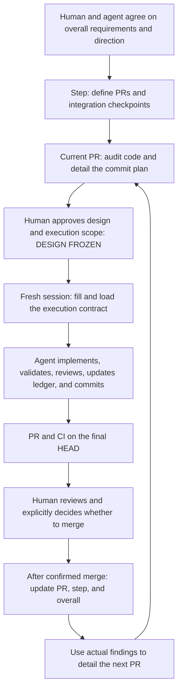

# Structured Coding

[Chinese mirror](README.zh-CN.md)

Turn requirements into reviewable PRs, let an agent implement autonomously within clear boundaries, and use actual results to update the next plan.

This guide is for the people using the workflow. The agent starts at [SKILL.md](SKILL.md), with detailed operating guidance in [agent-workflow.md](references/agent-workflow.md). The refined [PR design requirements](prompts/pr-design-requirements.md), [execution template](prompts/implementation-working-rules.md), and [TEST / CI / GATE rules](prompts/test-ci-gate-rules.md) are preserved in full. See [prompt provenance](references/prompt-provenance.md) for the exact preservation boundaries.

English is the only authoritative version. The Chinese page mirrors this explanation and retains English technical terms. Specifications and execution prompts remain English-only; a translation cannot amend them.

## Why planning has three layers

At the start of a substantial feature, you can usually discuss the intended outcome and cooperating modules before knowing what problems a particular function will expose. Writing every future PR down to function level at that point creates details based on unverified assumptions. Maintaining those premature details gets harder as implementation progresses.

This workflow assigns decisions of different precision to different layers. Distant work retains its direction; the immediate PR is detailed against actual code.

| Document | What to settle now | Level of detail |
| --- | --- | --- |
| Overall doc | Final requirements, direction, module relationships, risks, and step boundaries | Modules and major capabilities |
| Step doc | How many PRs the step needs, their responsibilities, and how they cooperate | Files or file groups and PR boundaries |
| PR design doc | How the current PR will be implemented, validated, reviewed, and accepted | Commits, files, and functions grounded in an audit |

Each PR should deliver an integration checkpoint. For example, “the option supplied through the CLI changes the actual reading sequence” is a more useful checkpoint than “three configuration fields were added.” Define adversarial criteria too: if one layer drops the option, what observation would expose it?

If a step needs only one PR, expand the step doc in place into the PR design doc. The three layers represent three kinds of questions; they do not require three documents with duplicate content.

## How one cycle progresses



For ordinary implementation problems, the agent stays in the autonomous loop to investigate and repair them. Material issues that change scope, acceptance, or frozen constraints return to the operator with evidence and concrete choices. You can begin review while CI runs; the agent still needs to reach the agreed completion conditions.

## Where people participate

At the start, describe the desired behavior, existing behavior that must remain intact, scope, and cost limits. The agent can read code, assess impact, and propose boundaries and risks. Product requirements, direction, and consequential tradeoffs need your judgment.

Before execution, review the current PR design. Focus on whether the goal and scope are right, each checkpoint proves the requirement, frozen constraints are clear, and budgets and stop conditions are explicit. You do not need to choose every local function implementation in advance, but the agent needs clear decision boundaries.

During execution, the agent can audit, implement, add tests, consult official sources, fix ordinary bugs, perform logic review, maintain the ledger, and create commits autonomously. Within the authorized scope, it also opens the PR and handles CI. Before committing, it still checks the diff, staged files, tests, and deviations; these checks do not require your approval each time.

At the end of each PR, review the code and complete record before deciding whether to merge. Check what was delivered, how it differs from the plan, whether those differences have reasons and evidence, and whether unresolved issues affect acceptance. Merge requires your explicit authorization.

| Situation | Agent action | Human involvement |
| --- | --- | --- |
| A planned function lives in another module | Audit, correct the path, record the finding, and continue | Usually unnecessary |
| Another caller needs to propagate an option | Assess impact, complete propagation and validation, and continue | Unnecessary if scope and invariants hold |
| A Unit test or CI exposes an ordinary bug | Read the complete error, diagnose, repair, and revalidate | Usually unnecessary |
| A public schema or frozen metric semantics must change | Prepare evidence, impact, and a concrete proposal | A material decision is required |
| Meaningful real validation exceeds the approved budget | Estimate the smallest useful run and its cost | Expanded authorization is required |
| Acceptance is satisfied and final-HEAD CI is green | Deliver the review handoff and await the merge decision | Review and merge authorization are required |

Existing authorization remains valid. If the contract already allows a small real-training run, the agent need not ask again before launching it. A template's default budget does not replace actual authorization for the current project.

## Why the document stays live after design freeze

The goal, scope, key invariants, and acceptance criteria are frozen. Completed work, discoveries, and corrected assumptions still need to be recorded as implementation happens.

The PR design doc therefore serves two consecutive purposes. Before execution, it establishes agreement between the person and the agent. During execution, it records actual progress and evidence. At final review, the same document explains both the original plan and why the implementation took its final form.

Track implementation, validation, and review separately for each commit. Validation uses observed execution to establish a specified behavior; review uses LLM analysis to examine logic, callers, and omissions. Passing tests does not complete review, and reading code does not mean tests ran. Each checked item should have its own evidence.

For example, if the real caller chain contains an extra layer, the agent should record the prior assumption, audited chain, correction, and additional validation, then continue. If the existing public protocol cannot express the approved requirement, the agent must bring that decision back instead of silently changing the protocol.

## Why validation has separate owners

Different evidence answers different questions. A Unit test can establish a calculation for given inputs, but a mock cannot prove that a real training process publishes its output on time. A real-model test can show whether a model follows a prompt without repeatedly owning the proof of a purely numerical formula.

| Validation layer | Questions it can answer |
| --- | --- |
| Static tools | Types, formatting, and statically detectable call errors |
| Unit | Deterministic rules, local calculations, boundaries, and failure classification |
| Gate 1 | Whether a real LLM generates, interprets, and crosses protocol boundaries as intended |
| Gate 2 | Whether real data, files, processes, training, or inference follow the intended lifecycle and timing |
| CI | Whether the final commit satisfies the repository's required automated checks |

Map Gate names to the project's own terminology. An ordinary backend project does not need to add an LLM or training pipeline to use this skill. Mark a layer as not required when no corresponding claim needs it.

During development, run validation relevant to the change. Expensive full-suite checks normally belong to the final PR's canonical CI. Existing required checks still apply; avoiding duplicate evidence does not justify bypassing them. Even if a Gate exits with code zero, inspect whether its artifacts establish the claim stated before the run.

## Why each PR starts fresh but the same PR must resume

Knowledge across PRs should come from merged code and updated parent documents. The preceding PR's conversation may contain failed attempts, temporary state, or assumptions that never reached the merged implementation. Carrying that entire context into the next PR can turn these into apparent current facts.

Each new PR therefore begins in a fresh implementation session with a newly filled contract. Prepare the design and kickoff in the planning session, then launch execution in the fresh session.

Compaction within a PR leaves the task unchanged. Recovery checks git, processes, PR design, handoff, and execution rules, then continues from the recorded next action. The handoff explains the current checkpoint, running processes, and next action; the PR design carries goals, decisions, and evidence.

Synchronize records before manual compact. If automatic compact arrives before that synchronization, the future hook should save a mechanical snapshot, permit compaction, and require reconciliation on resume. A hook must not fabricate a semantic summary when context is already tight or indefinitely block automatic compact because a handoff is stale.

## Why post-merge planning details only the next move

Merge makes this implementation a code fact the next iteration can depend on. Update the PR status, then the step and overall documents. Backward updates cover both completed capabilities and evidence, and the implications for future work.

Suppose a step makes data reading order controllable. PR A connects configuration to the reader; PR B improves resume behavior. While implementing A, the agent discovers that resume stores a file position, but the same file may appear twice in the input list. After A merges, the step doc records the actual data flow and adjusts B to handle duplicate-file identity and resume position. The overall doc records progress and the newly discovered risk.

B now deserves detailed audit. More distant performance work can retain a dependency note until B supplies actual results. If this iteration disproves the overall direction, report that immediately; detailing only one step ahead must not hide broader implications.

## How to start

Place the complete skill folder according to the [platform notes](references/platforms.md). The short messages below enter the workflow; the agent still reads the complete prompts and current contract during execution.

Start from requirements:

```text
Use the structured-coding workflow for this feature. First agree with me on
requirements, module-level direction, and overall step boundaries; then detail
the current step. Work on planning for now.
Requirements: ...
```

Prepare the current PR:

```text
Read the overall and step documents, audit the current code, and prepare the
PR 01a design doc and filled execution contract. Follow the original PR
requirements for the commit checklist. Separate implementation, validation,
and review, and prepare the design for my approval.
```

Execute in a fresh session:

```text
Execute PR 01a. The approved DESIGN FROZEN document is docs/plan/pr-01a.md,
and the filled contract is docs/plan/pr-01a-contract.md.
Use structured-coding. Read Implementation Working Rules and TEST / CI / GATE
in full, reconcile actual state, and begin.
Continue autonomously to READY FOR OPERATOR REVIEW under the contract.
Do not merge.
```

For Codex, prefix the message with `$structured-coding`; for Claude Code, use `/structured-coding`. The contract must contain actual paths, base, scope, budget, and stop conditions. These messages are interaction examples.

When the PR is ready, review the handoff and diff, request repairs or explicitly authorize merge. After confirmed merge, have the agent update parent plans and prepare the next PR design, then begin the next fresh execution session.

## What this package contains

This edition includes the complete skill, explanations for both audiences, preserved long prompts, and the [hook behavior contract](references/hook-contract.md). Codex and Claude Code use the same core, with only the needed platform metadata differing during packaging.

Hooks are not implemented or installed. The skill asks the agent to perform freeze, recovery, and merge checks; future hooks would enforce the contract at host tool boundaries. The distinction and platform sources are in [platform notes](references/platforms.md).
