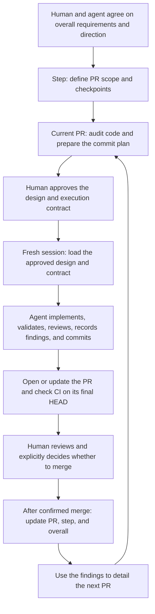

# Structured Coding

[Chinese mirror](README.zh-CN.md)

You give an agent a feature to build. It changes several files, tests fail, and the implementation uncovers something the plan missed. You need to know whether it can fix that detail and continue, or whether the discovery changes what you agreed to build.

Structured Coding makes that decision easier. You and the agent agree on the goal and boundaries of one PR. The agent implements it, checks the result, and records what happened. You review the finished change before merge. What you learn from that PR then shapes the next one.

This guide explains how to work with the agent. The detailed instructions are in [SKILL.md](SKILL.md) and [agent workflow](references/agent-workflow.md). The complete [PR requirements](prompts/pr-design-requirements.md), [execution prompt](prompts/implementation-working-rules.md), and [TEST / CI / GATE rules](prompts/test-ci-gate-rules.md) remain separate. See [prompt provenance](references/prompt-provenance.md) for their preservation record.

English is the only authoritative version. The Chinese mirror keeps the same meaning and English technical terms. Specifications and execution prompts remain English-only.

## Plan the next change at the level you can actually inspect

At the start, you may know what the feature should do and which modules it will involve. You usually know less about the exact functions a later PR will need. If you write those details now, later discoveries can make you rewrite a plan that never matched the code.

The workflow keeps three levels of detail. Work further away gets a direction and boundaries. The current PR gets a plan based on inspected code.

| Document | Question it answers | Detail to include |
| --- | --- | --- |
| Overall doc | What are we building, and what are the main steps? | Requirements, modules, major capabilities, risks, and step boundaries |
| Step doc | Which PRs will complete this step, and how do they fit together? | Files or file groups, their relationships, PR scope, dependencies, and checkpoints |
| PR design doc | What will we change next, and how will we know it is done? | Audited files and functions, commit plan, validation, review, and acceptance criteria |

An audit means reading the relevant code, its callers, and its tests to check the plan's assumptions. The agent does that before naming the exact files and functions to change.

Take a hypothetical feature: add an alphabetical reading mode while preserving the current default. One PR connects the CLI option to the reader. Its checkpoint should establish that the option reaches the reader and changes what it visits. A test could supply files `[c, a, b]`, enable the new mode, and observe visits `[a, b, c]`. Merely finding the new value in configuration would leave the main claim untested. The existing default needs its own unchanged-behavior evidence.

An integration checkpoint is a result that shows the relevant parts working together. Its adversarial criteria describe a broken implementation that the checks must catch. Here, dropping the option between configuration and reader should make the check fail. Each PR gets such a checkpoint so you can judge what it delivered.

If a step takes only one PR, expand its step doc in place into the PR design doc. You still answer all three levels of questions without keeping duplicate plans.

## Follow one PR from agreement to merge



The execution contract records what this PR may change, what must stay true, which actions and validation runs are authorized, and where the agent should stop. Fill it before execution so the agent can make local decisions against an agreed boundary.

An ordinary bug keeps the agent in the implementation loop: investigate, fix, validate, and continue. A discovery that requires a different public interface or acceptance criterion brings the affected decision back to you. CI runs the repo's automated checks on the change. You can start reviewing while those checks run, but the agent still has to reach the contract's completion conditions.

This workflow takes effort to maintain. The agent must keep the design and evidence current, and you must review the scope and final result. That effort gives you a record you can inspect and a place from which the agent can resume. It does not guarantee that every plan, test, or LLM review is correct.

## Decide the boundaries, then let the agent work inside them

At the beginning, explain the behavior you want, the existing behavior that must survive, what is outside scope, and the cost limits. The agent can inspect the repo, trace callers, propose PR boundaries, and point out risks. You decide product requirements, direction, and tradeoffs that would lead to materially different results.

Before execution, review the current PR design. Check that its goal matches yours and that its acceptance criteria describe an observable result. Identify the conditions that must remain true during the change; these are the frozen invariants. You do not have to settle every local implementation detail in advance.

Once that design and contract are approved, the agent can implement, add tests, consult official sources, repair ordinary bugs, review logic, update the PR design, and create commits. It can also publish the branch, open or update the PR, and repair CI when those actions are authorized. Before each commit it checks the diff, staged files, tests, and deviations, then continues without asking you to approve that commit.

| What the agent finds | What it does next | When you participate |
| --- | --- | --- |
| A function lives in a different module | Inspect it, correct the plan's path, record the finding, and continue | Usually no decision needed |
| An extra caller needs to pass the option | Trace its consumers, complete the change and validation, and continue | No decision needed while scope and invariants hold |
| A Unit test or CI exposes an ordinary bug | Read the full error, diagnose it, repair it, and revalidate | Usually no decision needed |
| The solution requires a public schema or frozen metric change | Prepare evidence, consequences, and a concrete proposal | Decide whether to change the approved design |
| A meaningful real run exceeds the approved budget | Estimate the smallest useful run and its cost | Decide whether to authorize the larger run |
| The PR meets acceptance and final-HEAD CI is green | Present the complete review handoff | Review the result and explicitly authorize any merge |

Existing authorization still counts. If the contract already permits a bounded real-training run, the agent need not ask again for that same run. An example budget printed in a template does not grant authorization by itself.

At final review, compare the delivered behavior with the agreed goal. Read the deviations and their evidence, check any remaining limitations, and then decide whether to merge. Passing CI is evidence for that review; merge still needs your explicit authorization.

## Freeze the agreement and keep the record current

After you approve a PR design, it gets a `DESIGN FROZEN` header. The goal, scope, invariants, and acceptance criteria are now agreed. The document continues to record progress, discoveries, decisions, and evidence as implementation proceeds. That running record is its live ledger.

Suppose the reading-mode plan names a path from CLI configuration to the reader. During implementation, the agent finds a job builder between them. That builder also needs to carry the option. If this preserves the approved behavior and scope, the agent records the old assumption, the actual path, its correction, and the validation, then continues. If the solution instead requires changing a public protocol, it prepares that decision for you.

Track implementation, validation, and review separately for each commit. Implementation records the change. Validation records what a test or real run observed. Review records the LLM's inspection of logic, contracts, callers, and possible omissions. Each checked item needs its own evidence. Passing a test does not tell you that the planned review happened.

At the end, the design doc should let you follow what was planned, what was discovered, and why the final code looks the way it does. Record failed assumptions when they matter; silently replacing them with the final answer would remove information you need for review.

## Choose a check that observes the property you need

For the reading-mode example, checking a configuration value answers whether the option was stored. Observing the reader visit `[a, b, c]` answers whether the option affected reading. Choose evidence that reaches the behavior your acceptance criterion promises.

Other claims need other checks. A Unit test can prove a calculation for supplied inputs. A mock that writes a file immediately cannot establish whether a real training process writes that file in time. The latter needs a run through the actual process.

| Layer | What it checks |
| --- | --- |
| Static tools | Types, formatting, and call errors the tools can detect without running the behavior |
| Unit | Deterministic rules, local calculations, boundaries, and failure classification for explicit inputs |
| Gate 1 | Whether a real LLM responds to the prompt and crosses the required protocol boundaries |
| Gate 2 | Whether real data, files, processes, training, or inference follow the required lifecycle and timing |
| CI | Whether the final commit passes the repo's required automated checks |

Gate 1 and Gate 2 are the workflow's labels for real-LLM and real-lifecycle checks. Use the project's corresponding commands. A backend change with no LLM behavior does not need to introduce a model test just to use the skill. Record a layer as not required when no acceptance claim needs it.

During development, run the checks relevant to each change. Expensive full-suite checks normally belong to the final PR's canonical CI, the run used as its final CI evidence. Keep existing required checks; avoid rerunning the same expensive suite without a new reason.

Read the actual Gate logs and artifacts before calling a run successful. An exit code of zero does not establish that the intended path ran. CI evidence also belongs to the HEAD it tested: if review leads to another code change, revalidate the affected behavior and obtain CI evidence for the new final HEAD.

## Start the next PR fresh, and resume the current PR where it stopped

The previous PR's chat can contain abandoned approaches, temporary state, and assumptions that changed during implementation. A new PR should begin from merged code and updated parent plans, so each new PR uses a fresh implementation session with its own filled contract.

Compaction during the same PR is different. The host shortens the conversation to free context, but the implementation task and completed work remain. The agent checks the repo and running processes, reloads the current design and execution rules, and continues from the recorded checkpoint.

The handoff file holds the details needed to continue: current PR, branch and HEAD, completed checkpoint, running jobs and logs, unresolved issues, and the exact next action. The PR design retains the goals, decisions, and validation evidence. Together they let the next continuation establish what is actually happening without relying on chat memory alone.

For example, if a Gate is still running at compact time, the handoff identifies that job and its log. On resume, the agent checks the job before starting another. That prevents it from spending the budget twice because it lost conversational context.

Before manual compact, synchronize the design and handoff with actual state. If automatic compact arrives while the handoff is stale, the future hook should save a mechanical snapshot, such as branch, HEAD, and changed-file state, allow compact, and require recovery. It must not invent decisions or test results, or keep blocking an unavoidable compact. Hooks are not installed in this edition; these checks currently rely on the agent following the workflow.

## Use the merged result to plan the next PR

After a confirmed merge, mark the PR merged and update its parent step, then the overall doc. Record both what was delivered and what the findings change about future work. This is the backward update: facts from implementation go back into the plans that led to it.

Return to the reading feature. PR A connects the new option to the reader; PR B will handle resume. While implementing A, the agent discovers that resume remembers a filename. A list such as `[a, b, a]` shows the missing distinction: the filename `a` alone cannot say which occurrence should resume. This is a hypothetical example of the kind of finding the ledger should preserve.

After A merges, the step doc records the actual data path and adjusts B to address occurrence identity and resume position. The overall doc records progress and the newly discovered risk. B now has a concrete issue to audit before its detailed design is frozen.

Detail that next PR using the merged code. More distant performance work can keep a dependency note until B supplies further evidence. If a finding already invalidates the overall direction, report it now. Planning one step ahead does not excuse hiding a wider problem.

## Start with a request, then prepare the execution session

Install the complete skill folder as described in [platform notes](references/platforms.md). In Codex, prefix your message with `$structured-coding`; in Claude Code, use `/structured-coding`.

Start from requirements:

```text
Use the structured-coding workflow for this feature. First agree with me on
requirements, module-level direction, and overall step boundaries; then detail
the current step. Work on planning for now.
Requirements: ...
```

Prepare the current PR:

```text
Read the overall and step documents, audit the current code, and prepare the
PR 01a design doc and filled execution contract. Follow the original PR
requirements for the commit checklist. Separate implementation, validation,
and review, and prepare the design for my approval.
```

Review the concrete design and contract before approving execution. Put the actual paths, implementation base, scope, budget, and stop conditions into the contract. Then open a fresh implementation session:

```text
Execute PR 01a. The approved DESIGN FROZEN document is docs/plan/pr-01a.md,
and the filled contract is docs/plan/pr-01a-contract.md.
Use structured-coding. Read Implementation Working Rules and TEST / CI / GATE
in full, reconcile actual state, and begin.
Continue autonomously to READY FOR OPERATOR REVIEW under the contract.
Do not merge.
```

These messages are entry points, not replacements for the complete prompts. The agent still reads the current contract and full execution rules. `READY FOR OPERATOR REVIEW` means the agreed implementation, review, and validation are complete, the PR is opened or updated, and required CI is green on its exact final HEAD.

Review the handoff and diff when the agent reaches that point. Request repairs if needed, or explicitly authorize merge. After merge is confirmed, have the agent update the parent plans and prepare the next PR design. Start that PR's execution in another fresh session.

## Know what the package provides

The package contains the skill, explanations for people and agents, the complete prompts, and a [hook behavior specification](references/hook-contract.md). Codex and Claude Code receive the same core; packaging adds only the platform metadata each needs.

The hook specification describes what future guards must check before implementation, compact/resume, and merge. No executable hooks are implemented or installed here. The skill tells the agent to perform the checks, but that instruction is not a mechanical interception of tool calls. See [platform notes](references/platforms.md) for the host integration boundaries and sources.
