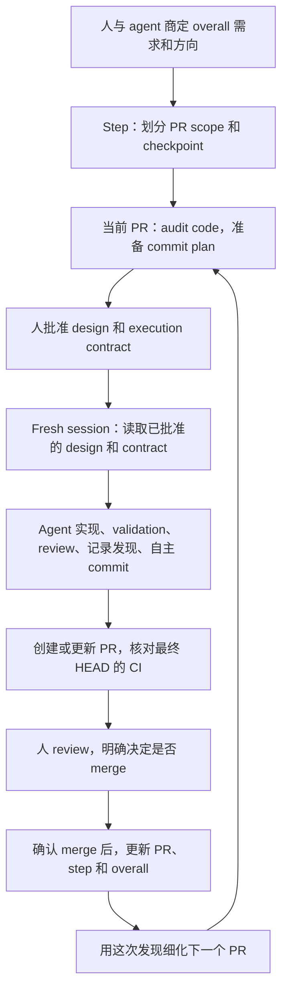

# Structured Coding

[English source](README.md) · 英文是唯一权威源，本页是中文镜像。

你让 agent 做一个功能。它改了几个文件，test 没过，又发现原计划漏了一件事。到这儿，你得判断：这个细节它能自己修完接着干，还是说，发现的问题已经改变了你们原来要做的东西？

Structured Coding 把这个判断提前讲清楚。你和 agent 先商定一个 PR 要完成什么、哪些地方不能越界。接下来它自己实现、检查，把途中发生的事记下来。做完以后，你 review，再决定是否 merge。这一轮查明白的事，接着用来改下一轮计划。

这份指南讲你怎么跟 agent 配合。给 agent 的详细指令放在 [SKILL.md](SKILL.md) 和 [agent workflow](references/agent-workflow.zh-CN.md)。完整的 [PR requirements](prompts/pr-design-requirements.md)、[execution prompt](prompts/implementation-working-rules.md) 和 [TEST / CI / GATE rules](prompts/test-ci-gate-rules.md) 单独保留，原文怎么保存的见 [prompt provenance](references/prompt-provenance.zh-CN.md)。

英文是唯一权威版本。中文镜像保持同样的含义，专业术语保留英文。specification 和 execution prompt 只维护英文。

## 眼前能查到哪一步，计划就细到哪一步

刚开始做一个大功能，你通常知道它最后该干什么，也大致知道会涉及哪些模块。可后面几个 PR 具体要改哪些函数，现在未必查得准。提前写得越细，后面发现实际 code 对不上，回头改计划的活儿就越多。

所以这套工作流保留三层。离得远的工作，先定方向和边界；眼前这个 PR，读过相关 code 以后再细化。

| 文档 | 它要回答什么 | 细到哪里 |
| --- | --- | --- |
| Overall doc | 最后要做出什么，主要分几步？ | 需求、模块、大功能、风险和 step 边界 |
| Step doc | 这一步需要几个 PR，它们怎么接上？ | 文件或文件组、彼此关系、PR scope、依赖和 checkpoint |
| PR design doc | 接下来具体改哪里，怎么知道做完了？ | audit 过的文件和函数、commit plan、validation、review 和验收条件 |

这里的 audit，就是去读相关 code、调用它的地方和 test，核对计划里的假设。agent 先查这些，再写具体要改哪些文件和函数。

拿个假设的功能走一遍：给 reader 加一个按字母顺序读取的模式，原来的默认行为保持不变。一个 PR 负责把 CLI 选项传到 reader。验收时得看到选项真的传到了，而且 reader 的读取顺序也变了。比如输入文件是 `[c, a, b]`，打开新模式以后，实际访问顺序应该是 `[a, b, c]`。光看配置里多了个值，这一步还没证明。原来的默认行为，也得另外拿证据确认没变。

把相关部分接起来，观察它们是否一起完成了预期动作，这就是 integration checkpoint。还要想好一种错误实现，确认检查能把它抓出来，这里叫 adversarial criteria。放到这个例子里，如果配置到 reader 的中间某一层没把选项传下去，检查就应该失败。每个 PR 都有这样的 checkpoint，你才好判断这一轮到底交付了什么。

一个 step 如果只需要一个 PR，就把 step doc 原地补成 PR design doc。三层要回答的问题照样回答，不用为同一份计划维护两个副本。

## 跟着一个 PR 从商量走到 merge



Execution contract 里写清楚：这个 PR 允许改什么、哪些条件必须保持、哪些操作和 validation 已经授权，以及 agent 应该停在哪儿。execution 开始前先填好，agent 遇到局部问题时就有依据可查。

普通 bug 出现了，agent 留在实现流程里查原因、修复、validation，然后继续。如果必须换一个 public interface，或者验收条件得跟着变，就把受影响的决定带回来找你。CI 会针对这次改动运行 repo 的自动检查。检查跑着的时候，你可以先 review，不过 agent 仍然得把 contract 里约定的完成条件满足。

这套流程也有成本。agent 得持续更新 design 和证据，你得 review scope 和最终结果。这些工作让你有记录可查，也让 agent 中断以后知道从哪儿接着做。计划、test 和 LLM review 本身仍然可能出错，不能因为流程走全了，就认定结果一定对。

## 你把边界定清楚，范围内的事让 agent 接着干

开始时，你说清楚想要什么行为、哪些旧行为必须保留、哪些事不在 scope 里，以及成本上限。agent 可以读 repo、顺着调用关系查、建议怎么拆 PR、指出风险。产品需求、大方向，以及会带来明显不同结果的取舍，由你决定。

Execution 前，review 当前 PR design。先看 goal 和你的要求是不是一回事，再看验收条件能不能观察到实际结果。把改动过程中必须始终成立的条件列出来，这些就是 frozen invariants。至于每个局部函数究竟怎么写，没必要现在全钉死。

Design 和 contract 批准以后，agent 就可以实现、补 test、查官方资料、修普通 bug、review 逻辑、更新 PR design 和自主 commit。已经授权的话，它也可以发布 branch、创建或更新 PR、修复 CI。每个 commit 前，仍然要看 diff、staged files、test 和偏离情况。检查完就继续，不用每次再等你点头。

| Agent 查到了什么 | 接下来怎么做 | 什么时候找你 |
| --- | --- | --- |
| 函数实际在另一个模块 | 读 code，修正计划里的路径，记下来，继续 | 通常不用你决定 |
| 还有一个调用方得传这个选项 | 顺着查到使用选项的地方，补齐改动和 validation | scope 和 invariants 没变，就继续 |
| Unit test 或 CI 暴露普通 bug | 读完整错误，定位，修复，再验证 | 通常不用你决定 |
| 解决办法要求改变 public schema 或冻结的 metric | 准备证据、影响和具体建议 | 由你决定是否改已批准的 design |
| 有意义的真实运行超出预算 | 估算最小可用的运行规模和成本 | 由你决定是否增加授权 |
| PR 达到验收条件，最终 HEAD 的 CI 通过 | 交付完整 review handoff | 你 review，并明确授权是否 merge |

已经给过的授权照样算数。contract 如果允许一次有界的真实 training，就不用为了同一次运行再问一遍。可模板里写了一个示例预算，不等于当前项目已经拿到了这份授权。

最后 review 时，把实际交付的行为和原先商定的 goal 对一下，再看偏离的理由、证据和剩余限制，决定是否 merge。CI 通过是供你判断的证据；merge 仍然需要你的明确授权。

## 商定的要求 freeze，执行记录接着写

PR design 获得批准后，加上 `DESIGN FROZEN` header。这时，goal、scope、invariants 和验收条件已经商定。文档还得继续记进度、新发现、决定和证据。这份边做边更新的记录，就是 live ledger。

还看读取顺序这个例子。计划里写着 CLI 配置传给 reader，真正实现时，agent 查到中间还有一个创建 job 的环节。这个环节也得把选项带过去。如果这样改没有动已批准的行为和 scope，agent 就把原假设、真实路径、修正办法和 validation 记下来，然后继续。如果解决办法要求改变 public protocol，就先把这个决定准备好，交给你判断。

每个 commit 的 implementation、validation 和 review 分开记录。Implementation 说明改动做完了；validation 记录 test 或真实运行观察到了什么；review 记录 LLM 对逻辑、contract、调用关系和遗漏的检查。每一项打勾，都得有对应证据。一个 test 过了，不能顺手把还没做的 review 也勾上。

到最后，你应该能顺着 design doc 看明白：原来打算怎么做，中间发现了什么，最后的 code 为啥写成这样。有影响的失败假设也留着，直接用最终答案把它盖掉，你 review 时就少了一段来龙去脉。

## 想证明哪件事，就让检查真走到那一步

读取顺序这个例子里，检查配置值，只能说明选项存进去了。观察 reader 实际按 `[a, b, c]` 访问，才能说明选项影响了读取。验收答应交付什么行为，证据就得跟到那里。

别的结论要用别的检查。Unit test 可以证明给定输入时计算结果正确。可你让 mock 立刻写出一个文件，不能据此判断真实 training process 会不会及时写出来。后面这件事，得让真实 process 跑一遍。

| 层次 | 具体检查什么 |
| --- | --- |
| Static tools | 不运行这段行为也能查出的类型、格式和调用错误 |
| Unit | 明确输入下的确定性规则、局部计算、边界和失败分类 |
| Gate 1 | 真实 LLM 是否按 prompt 响应，并通过所需的 protocol 边界 |
| Gate 2 | 真实 dataset、文件、process、training 或 inference 是否按要求运行，时序是否满足要求 |
| CI | 最终 commit 是否通过 repo 要求的自动检查 |

Gate 1 和 Gate 2 是这套工作流给两类检查起的名字：前一个查真实 LLM，后一个查真实运行过程。执行时对应到项目自己的 command。backend 改动没涉及 LLM，就不用为了套这个 skill 额外加 model test。没有哪条验收要求需要这一层，就记录为不需要。

开发过程中，运行与当前改动相关的检查。昂贵的 full-suite 检查通常放到最终 PR 的 canonical CI，也就是这轮 PR 最后采用的 CI 证据。repo 已有的必需检查照样保留；没有新理由，就别把同一套昂贵检查反复跑。

Gate 跑完，读实际 log 和产物再判断有没有成功。exit code 为 0，不代表要验证的那条路径一定跑到了。CI 证据也只对应它测过的 HEAD。review 后又改了 code，就重验受影响的行为，并取得新最终 HEAD 的 CI 证据。

## 下一个 PR 开 fresh session，当前 PR 从停下的地方续上

上一个 PR 的聊天里，可能还留着放弃的方案、临时状态，以及实现过程中已经改掉的假设。下一个 PR 应该从 merged code 和更新后的 parent 计划出发，所以每个新 PR 都开 fresh implementation session，加载自己那份填好的 contract。

同一个 PR 中途 compact，情况就不一样了。平台缩短对话来腾出 context，但任务还是这个任务，做完的工作也还在。agent 检查 repo 和运行中的 process，重新读当前 design 和 execution rules，再从记录的 checkpoint 继续。

要续上，得知道眼下做到哪儿。handoff 文件就记这些：当前 PR、branch 和 HEAD、完成到哪个 checkpoint、哪些 job 还在跑、log 在哪儿、什么问题没解决，以及下一步准确要做什么。PR design 则保留 goal、决定和 validation 证据。恢复时把两边和实际状态对一下，才能接着干，不用全靠聊天记忆。

比如 compact 时一个 Gate 还在运行，handoff 就记下这个 job 和 log。恢复以后先查原来的 job，再决定要不要启动新的。这一步能避免因为忘了前面的对话，把同一份预算花两遍。

手动 compact 前，先把 design、handoff 和实际状态同步。如果自动 compact 来的时候 handoff 还旧着，未来的 hook 应保存 branch、HEAD、改动文件状态这些机械 snapshot，允许 compact，再要求恢复核对。它不能临时编造决定或 test 结果，也不能把躲不开的 compact 一直挡住。当前版本还没安装 hook，这些检查暂时靠 agent 按工作流执行。

## 用 merge 后查明白的事，改下一轮计划

确认 merge 以后，先标记 PR 已 merge，再更新它的 parent step，最后更新 overall doc。两件事都要记：这次交付了什么，以及查到的事情会怎样影响后续工作。这就是 backward update，把实现得到的事实写回当初制定的计划。

回到读取功能。PR A 把新选项接到 reader，PR B 准备处理 resume。假设实现 A 时发现，resume 只记住了文件名。拿 `[a, b, a]` 往下走一步，问题就出来了：光有文件名 `a`，到底该从哪一次出现的位置继续？这是一个假设场景，用来说明 ledger 应该保留哪类发现。

A merge 以后，step doc 记下真实的数据路径，并调整 B，让它处理“同一个文件出现了几次、从哪个位置 resume”。overall doc 记录进度和新发现的风险。这样 B 在详细 design freeze 之前，就有一个具体问题要先 audit。

接下来重点细化这个 PR，依据是 merged code。更远的性能工作，可以先留一条依赖说明，等 B 做完再补细节。如果这次发现已经推翻了整体方向，现在就说。只详细往前计划一步，不代表更大的问题可以先藏着。

## 先提出需求，再准备 execution session

按 [platform notes](references/platforms.zh-CN.md) 安装完整 skill 文件夹。Codex 消息前加 `$structured-coding`；Claude Code 用 `/structured-coding`。

先从需求开始：

```text
Use the structured-coding workflow for this feature. First agree with me on
requirements, module-level direction, and overall step boundaries; then detail
the current step. Work on planning for now.
Requirements: ...
```

准备当前 PR：

```text
Read the overall and step documents, audit the current code, and prepare the
PR 01a design doc and filled execution contract. Follow the original PR
requirements for the commit checklist. Separate implementation, validation,
and review, and prepare the design for my approval.
```

先 review 具体 design 和 contract，再批准 execution。contract 里填真实路径、implementation base、scope、预算和停止条件。准备好了，开一个 fresh implementation session：

```text
Execute PR 01a. The approved DESIGN FROZEN document is docs/plan/pr-01a.md,
and the filled contract is docs/plan/pr-01a-contract.md.
Use structured-coding. Read Implementation Working Rules and TEST / CI / GATE
in full, reconcile actual state, and begin.
Continue autonomously to READY FOR OPERATOR REVIEW under the contract.
Do not merge.
```

这些消息只负责启动工作流，不替代完整 prompt。agent 仍然要读当前 contract 和完整 execution rules。`READY FOR OPERATOR REVIEW` 表示约定的 implementation、review 和 validation 已完成，PR 已创建或更新，而且必需 CI 在准确的最终 HEAD 上通过。

到这个节点，你 review handoff 和 diff。需要修就提出修改；准备 merge 就明确授权。merge 确认后，让 agent 更新 parent 计划、准备下一个 PR design。下一个 PR 的 execution，再开一个 fresh session。

## 这个包已经提供了什么

包里有 skill、给人和 agent 的说明、完整 prompt，以及 [hook behavior specification](references/hook-contract.md)。Codex 和 Claude Code 使用同一套核心内容，打包时只增加各自需要的 platform metadata。

Hook specification 规定了将来在 implementation、compact/resume 和 merge 前要查哪些条件。这里还没有实现或安装可运行的 hook。skill 会告诉 agent 做这些检查，但它不是在工具调用前执行的机械拦截。平台集成的边界和依据见 [platform notes](references/platforms.zh-CN.md)。
