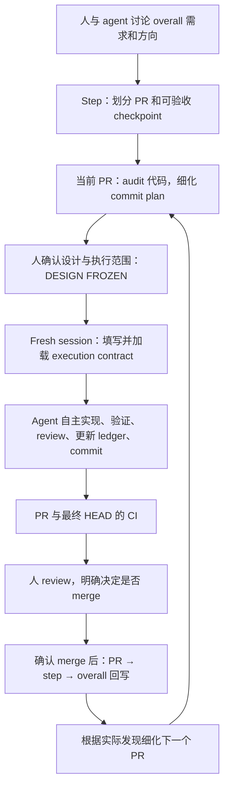

# Structured Coding

[English source](README.md) · 英文是唯一权威源，本页是中文镜像。

把需求逐层变成可以验收的 PR，让 agent 在明确的范围内自主完成实现，再用真实结果更新下一步计划。

这份指南给使用工作流的人看。agent 的入口是 [SKILL.md](SKILL.md)，更细的操作说明在 [agent-workflow.md](references/agent-workflow.zh-CN.md)。你原先打磨的 [PR design 要求](prompts/pr-design-requirements.md)、[execution 模板](prompts/implementation-working-rules.md)和 [TEST / CI / GATE 规则](prompts/test-ci-gate-rules.md)各自完整保存，具体整理范围见 [原文保留说明](references/prompt-provenance.zh-CN.md)。

英文是唯一权威版本。本页同步英文说明，并保留英文专业术语。specification 和 execution prompt 仅维护英文；中文镜像不能修改这些规则。

## 为什么把计划分成三层

一个大功能刚开始设计时，通常能讨论清楚最终要什么、哪些模块要配合，却还不知道某个函数会暴露什么问题。如果这时把所有后续 PR 都写到函数级，很多细节会建立在尚未验证的假设上。实现越往后，维护这些预先写死的细节就越费劲。

这个工作流把不同精度的决定放在不同层。远处的计划保留方向，眼前的 PR 才根据真实代码展开。

| 文档 | 现在需要说清什么 | 细到哪里 |
| --- | --- | --- |
| Overall doc | 最终需求、大方向、模块关系、风险、分几个 step | 模块和大功能 |
| Step doc | 这一阶段需要几个 PR，各自负责什么，如何相互配合 | 文件或文件组的关系、PR 边界 |
| PR design doc | 当前 PR 怎么实现、怎么验证、怎么审查、怎样算完成 | commit，以及经 audit 确认的文件和函数 |

每个 PR 应当带来一个能做 integration 验证的 checkpoint。例如“CLI 传入的选项已经影响实际读取顺序”，就比“增加了三个配置字段”更适合作为 checkpoint。还要提前说明反例：如果某一层丢掉了选项，什么观察会揭露这个问题。

如果一个 step 只需要一个 PR，就把 step doc 原地扩充成 PR design doc。三层代表三种问题，不要求为了形式维护三份内容重复的文件。

## 一轮工作如何推进



出现普通实现问题时，agent 留在自主执行循环里查证和修复。出现改变范围、验收或冻结约束的重大问题时，才把证据和具体选择带回来讨论。你可以在 CI 运行时开始 review；agent 的执行任务仍需推进到约定的完成条件。

## 人在什么地方参与

开始时，你需要说明最终想要的行为、不能破坏的现有行为、范围和成本限制。agent 可以负责读代码、找影响面、提出拆分方案和风险。需要你决定的是产品需求、方向和有实际差别的取舍。

执行前，你 review 当前 PR 的设计。重点看目标和范围是否正确、每个 checkpoint 是否真的证明需求、哪些东西被冻结、预算和停止条件是否清楚。你不需要提前替 agent 选好所有局部函数写法，但要给它足够明确的判断边界。

进入 execution 后，可以放手让 agent audit、实现、补测试、查官方资料、修普通 bug、做逻辑 review、记 ledger、自主 commit，并在授权范围内开 PR、处理 CI。commit 前仍然检查 diff、暂存文件、测试和偏离；这些检查由 agent 完成，不需要你逐次批准。

每个 PR 完成时，你 review 代码和完整记录，决定是否 merge。检查的重点包括：实际交付了什么，和原计划有哪些差别，差别有没有理由和证据，未解决问题是否影响验收。merge 必须有你的明确授权。

| 情况 | Agent 的动作 | 你是否需要介入 |
| --- | --- | --- |
| 发现计划中的函数其实位于另一个模块 | audit 后修正路径，记录发现，继续 | 通常不需要 |
| 多了一个需要传递参数的调用者 | 检查影响，补齐传递与验证，继续 | 范围和约束不变时不需要 |
| Unit test 或 CI 暴露普通 bug | 读完整错误、定位、修复、重验 | 通常不需要 |
| 必须改变公共 schema 或冻结指标语义 | 准备证据、影响和具体建议 | 需要作实质决定 |
| 有意义的真实验证超出批准预算 | 先估算最小运行规模和成本 | 需要扩展授权 |
| PR 达到约定验收，最终 HEAD 的 CI 已通过 | 交付 review handoff，等待 merge 决定 | 需要 review 与 merge 授权 |

已给出的授权持续有效。比如 contract 已允许一次小规模真实训练，agent 无需在运行前再问一遍。模板中的默认预算则不能代替你对当前项目的实际授权。

## 为什么 design frozen 后还要一直更新文档

冻结的是目标、范围、关键约束和验收标准。实施过程中，完成了什么、发现了什么、原来的假设哪里不准确，仍然需要实时写下来。

PR design doc 因而有两个连续的用途：执行前，它让人和 agent 对计划达成一致；执行中，它记录真实执行进度和证据。这样最后 review 时，你可以从同一份文档看清“原来准备怎么做”和“最后为什么这样做”。

每个 commit 的实现、validation、review 分别打勾。validation 用运行结果证明指定行为；review 用 LLM 分析逻辑、调用关系和遗漏。测试通过不代表 review 已完成，读过代码也不代表测试已经运行。每个勾都应能找到对应证据。

比如实际调用链比设计多了一层，agent 应当记录原假设、查到的调用链、采取的修正和新增验证，然后继续。如果查到的是“现有公共协议根本表达不了批准的需求”，就需要带回给你决定，不能默默改协议。

## 为什么验证要分工

不同证据回答不同的问题。Unit test 可以证明给定输入时计算正确，却不能凭一个 mock 证明真实训练进程会及时写出结果。真实模型测试能观察模型是否遵循 prompt，却没必要反复承担一个纯数值公式的验证。

| 验证层 | 适合回答的问题 |
| --- | --- |
| Static tools | 类型、格式、能静态发现的调用错误 |
| Unit | 明确输入下的确定性规则、局部计算、边界与错误分类 |
| Gate 1 | 真实 LLM 是否按预期生成、理解和跨越协议边界 |
| Gate 2 | 真实数据、文件、进程、训练或推理流程是否走通，时序是否满足要求 |
| CI | 当前最终提交是否满足仓库要求的自动检查 |

Gate 名称可以映射到项目自己的叫法。普通后端项目不需要为了使用这个 skill 加入 LLM 或训练流程。没有对应需求的层直接记录为不需要。

开发过程中运行与改动对应的验证；昂贵的 full-suite 检查通常交给最终 PR 的 canonical CI。已有必需检查仍然要满足，不能借“避免重复”绕过。一个 Gate 的退出码为 0，也要查看产物是否真的证明了事先声明的结论。

## 为什么每个 PR 开 fresh session，同一个 PR 又要能续上

跨 PR 的知识应该来自已经 merge 的代码和更新后的父文档。上一个 PR 的聊天里可能保留着已经失败的尝试、临时状态或尚未合并的假设；直接把整段上下文带入下一个 PR，很容易把这些东西误当成当前事实。

所以每个新 PR 使用新的 implementation session，并加载新填写的 contract。你在 planning 会话里把设计和 kickoff 准备好，再到 fresh session 启动执行。

同一个 PR 内发生 compact 时，任务仍然是原来的 PR。恢复时重新确认 git、进程、PR design、handoff 和 execution 规则，然后从记录的下一步接着做。handoff 负责“现在做到哪、哪个进程还在跑、下一步是什么”；PR design 负责目标、决定和证据。

手动 compact 前先同步记录。自动 compact 来得太早时，未来的 hook 应保存机械状态快照并允许 compact，恢复后要求核对实际状态。不能让 hook 在上下文已经不足时临时编造一份语义总结，也不能因为 handoff 旧了就把自动 compact 无限挡住。

## merge 之后为什么只详细往前更新一步

merge 把本轮实现变成下一轮可以依赖的代码事实。此时先更新 PR 状态，再回写 step 和 overall。回写包含两件事：已经完成的能力和证据，以及这些发现对后续计划的影响。

假设一个 step 是“让数据读取顺序可控”。原先拆为 PR A 打通配置到 reader，PR B 完善恢复行为。A 的实现发现：恢复过程保存的是文件位置，而同一个文件可能在输入列表里出现两次。A merge 后，step doc 需要记录真实的数据流，并调整 B 的设计，让它处理重复文件的身份和恢复位置。overall doc 则更新这一阶段的进度和新增风险。

这时值得详细 audit 的是 B。更远的性能优化步骤可以先记一条依赖，等 B 的实际结果出来后再细化。若本轮发现已经推翻整个方向，也要立即说明，不能借“只更新一步”掩盖全局影响。

## 实际怎么开始

先按照 [平台说明](references/platforms.zh-CN.md) 放置对应的完整 skill 文件夹。下列短消息是工作流入口；执行时 agent 仍需读取完整 prompt 和当前 contract。

从需求开始：

```text
Use the structured-coding workflow for this feature. First agree with me on
requirements, module-level direction, and overall step boundaries; then detail
the current step. Work on planning for now.
Requirements: ...
```

准备当前 PR：

```text
Read the overall and step documents, audit the current code, and prepare the
PR 01a design doc and filled execution contract. Follow the original PR
requirements for the commit checklist. Separate implementation, validation,
and review, and prepare the design for my approval.
```

在 fresh session 中执行：

```text
Execute PR 01a. The approved DESIGN FROZEN document is docs/plan/pr-01a.md,
and the filled contract is docs/plan/pr-01a-contract.md.
Use structured-coding. Read Implementation Working Rules and TEST / CI / GATE
in full, reconcile actual state, and begin.
Continue autonomously to READY FOR OPERATOR REVIEW under the contract.
Do not merge.
```

实际使用时，在 Codex 消息前加 `$structured-coding`；Claude Code 用 `/structured-coding`。contract 中必须写入真实路径、base、范围、预算和停止条件，上面只是交互示例。

PR 完成后，你 review handoff 和 diff，给出修改意见或明确的 merge 授权。merge 确认后，让 agent 回写父计划并准备下一 PR 的设计，再开启下一轮 fresh execution session。

## 这份交付包含什么

当前版本提供完整 skill、双受众说明、保留的长 prompt，以及 [hook 行为约定](references/hook-contract.md)。Codex 和 Claude Code 使用相同核心，只在打包时保留所需的平台元数据。

hook 尚未实现或安装。skill 会要求 agent 执行 freeze、恢复和 merge 检查；未来的 hook 才负责在宿主工具调用处机械执行约定。两者的差别和平台依据见 [平台说明](references/platforms.zh-CN.md)。
